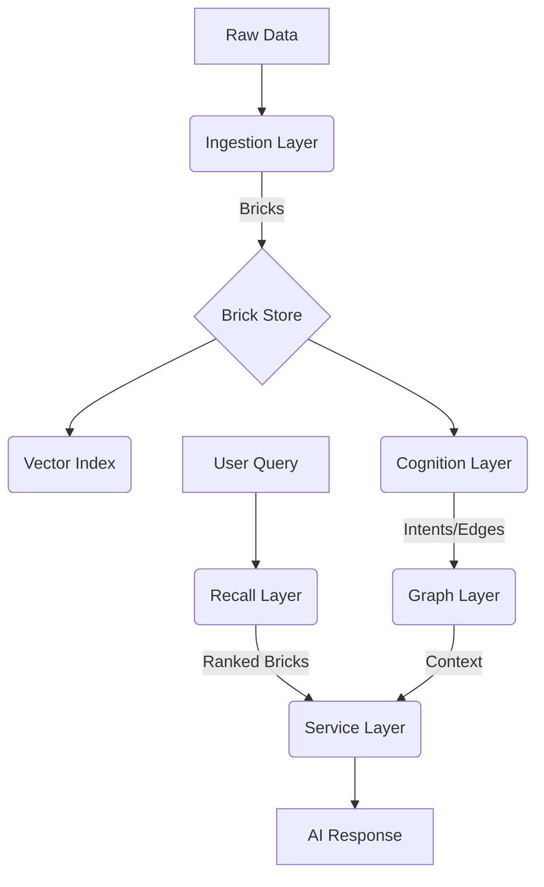

# NEXUS APPENDIX

## 1. Consolidated Class-Method Reference

| Class | Method | Responsibility | Used By | Layer |
| :--- | :--- | :--- | :--- | :---: |
| `GraphManager` | `register_node` | State persistence for Graph Nodes. | `Cognition`, `UI` | Graph |
| `GraphManager` | `register_edge` | Linking nodes with type/metadata. | `Cognition`, `UI` | Graph |
| `GraphManager` | `kill_node` | Logical removal of node. | `UI`, `Maintenance` | Graph |
| `NexusCompiler` | `compile_run` | End-to-end brickification. | `Runner`, `Tasks` | Ingestion |
| `NexusCompiler` | `_materialize_brick` | DB write for atomic Bricks. | `compile_run` | Ingestion |
| `CortexAPI` | `route` | Routing query to specific intent. | `UI`, `External` | Service |
| `CortexAPI` | `generate` | Final RAG-based response synthesis. | `UI`, `External` | Service |
| `LocalVectorIndex` | `search` | FAISS vector lookup. | `Recall`, `CortexAPI` | Vector |
| `VectorEmbedder` | `embed_query` | Query vectorization & rewriting. | `Recall`, `LocalIndex` | Vector |
| `CognitiveExtractor`| `forward` | Fact extraction from text. | `Assembler` | Cognition |
| `RerankOrchestrator`| `rerank` | Multi-pass result refinement. | `Recall` | Recall |
| `SyncDatabase` | `save_brick` | Persistence for Brick metadata. | `Compiler` | Ingestion |

## 2. Key Terminology Reference
- **Brick:** Atomic data unit containing raw content and source pointer.
- **Intent:** Distilled factual unit represented as a Graph Node.
- **Wall:** A projected view of the Graph tailored for specific topic analysis.
- **Recall:** The process of retrieving Bricks via semantic search and reranking.
- **Sync:** The background process that turns raw data into indexed Bricks.

## 3. Communication & Authority Graph
- **Graph Layer:** Authority over persistent state and logical consistency.
- **Cognition Layer:** Authority over truth inference and relationship discovery.
- **Service Layer:** Authority over query orchestration and audit logging.
- **Ingestion Layer:** Authority over data integrity and source attribution.

## 4. Visualizing the NEXUS Flow

*(Diagram represents high-level data flow through the system)*
