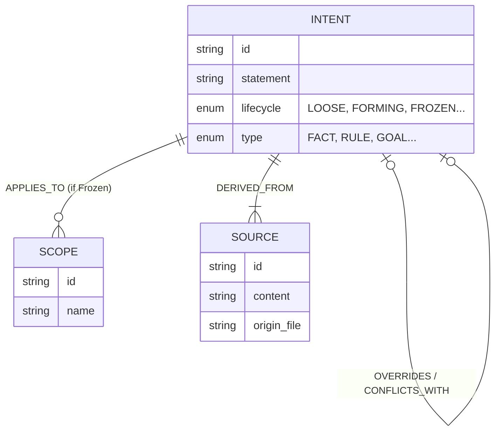

# Appendix

## A. Data Model Diagram



## B. System Architecture Flow

```mermaid
graph TD
    User[User / Jarvis UI] -->|HTTP| Cortex[Cortex API]
    
    subgraph Services
        Cortex -->|Recall| Vector[Vector Store (FAISS)]
        Cortex -->|CRUD| Manager[Graph Manager]
        Cortex -->|Assemble| Assembler[Cognitive Assembler]
    end
    
    subgraph Data
        Vector --> Embeddings[idx file]
        Manager --> SQLite[graph.db]
    end
    
    subgraph Offline
        Raw[conversations.json] -->|Ingest| Sync[Sync Process]
        Sync -->|Embed| Vector
        Sync -->|Extract| SourceBricks[Bricks]
    end
```

## C. Glossary

- **Brick**: An immutable fragment of raw conversation history.
- **Intent**: A mutable, structured assertion derived from Bricks.
- **Scope**: A bounded context for Intents.
- **Anchor**: The act of promoting a Loose Intent to a more permanent state.
- **Cognitive Assembly**: The process of synthesizing Bricks into Intents using LLMs.
