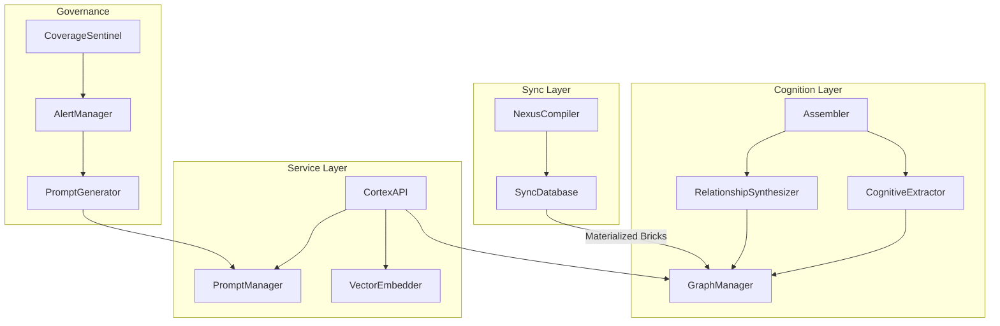

# Nexus: Appendix

## Master Class → Method Intelligence Table

| Class | Method | Responsibility | Risk | Used By | Idempotency |
|-------|--------|----------------|------|---------|-------------|
| `NexusCompiler` | `compile_run` | Orchestrates materialization of bricks from raw logs. | MED | CLI, `run_sync` | ✅ |
| `SyncDatabase` | `save_brick` | Persists brick artifact to SQLite. | MED | `NexusCompiler` | ✅ |
| `GraphManager` | `register_node` | Atomic node creation with attribute merging. | HIGH | `Cognition`, `Sync` | ✅ |
| `GraphManager` | `register_edge` | Creates typed relationships with cycle checks. | HIGH | `Synthesizer` | ❌ |
| `GraphManager` | `promote_node_to_frozen` | Lifecycle gatekeeper for production assets. | HIGH | UI, `CortexAPI` | ✅ |
| `GraphManager` | `supersede_node` | Replaces old intent versions while maintaining provenance. | HIGH | `Self-Healing` | ❌ |
| `PromptManager` | `get_prompt` | Fetches active system prompt by slug/version. | MED | `CortexAPI` | ✅ |
| `CognitiveExtractor`| `forward` | DSPy module for intent/entity extraction. | HIGH | `Assembler` | ✅ |
| `RelationshipSynthesizer`| `forward` | DSPy module for discovery of inter-intent edges. | HIGH | `Synthesizer` | ✅ |
| `AlertManager` | `persist_alert` | Records governance violations/gaps. | MED | `Sentinel` | ✅ |
| `CortexAPI` | `route` | Gateway for all agent/user queries. | HIGH | `Server`, UI | ✅ |
| `CortexAPI` | `ask_preview` | RAG-based context preview for auditing. | MED | UI | ✅ |
| `VectorEmbedder` | `embed_query` | Transforms text to vector with LLM-assisted rewrite. | MED | `Recall`, `Cortex`| ✅ |

## Cross-Class Interaction Graph

```mermaid
graph TD
    subgraph Sync Layer
        A[NexusCompiler] --> B[SyncDatabase]
    end
    
    subgraph Cognition Layer
        C[Assembler] --> D[CognitiveExtractor]
        C --> E[RelationshipSynthesizer]
        D --> F[GraphManager]
        E --> F
    end
    
    subgraph Service Layer
        G[CortexAPI] --> F
        G --> H[PromptManager]
        G --> I[VectorEmbedder]
    end
    
    subgraph Governance
        J[CoverageSentinel] --> K[AlertManager]
        K --> L[PromptGenerator]
        L --> H
    end
    
    B --Materialized Bricks--> F
```

## Glossary of Terms
- **Brick**: An atomic, immutable unit of knowledge extracted from source data.
- **Intent**: A specific behavior or instruction categorized in the graph.
- **Scope**: A logical grouping of intents (e.g., "Authentication", "Data Visualization").
- **Frozen**: A state indicating a node is validated and safe for production prompt inclusion.
- **Supersession**: The process of replacing an outdated node with a new one while preserving historical links.

## Failure Modes & Recovery
| Component | Failure | Recovery Action |
|-----------|---------|-----------------|
| Graph | Cycle Detected | `register_edge` raises exception; Transaction rolls back. |
| Cognition | LLM Hallucination | `CoverageSentinel` flags low-confidence synthesis as Alert. |
| Sync | Malformed JSON | `NexusCompiler` logs error and skips message range. |
| Cortex | Service Timeout | `JarvisGateway` retries with exponential backoff. |
