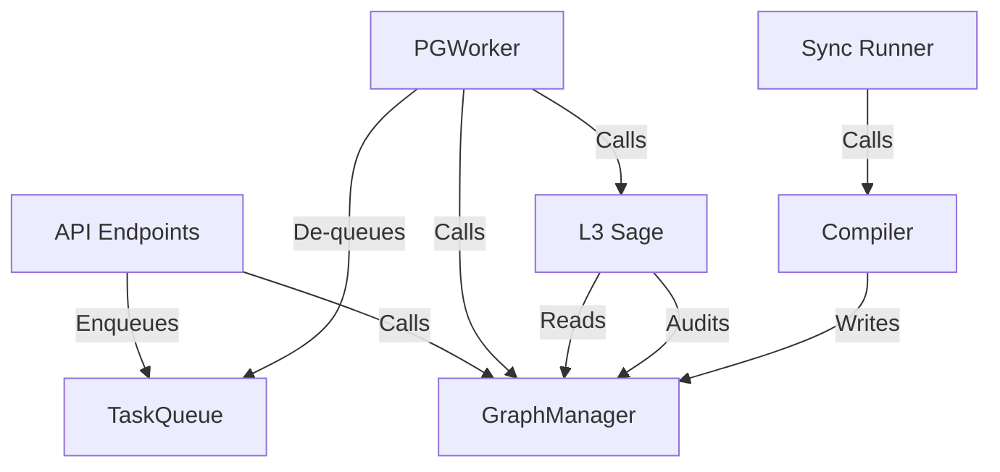

# Appendix: Code Intelligence Map

## Class → Method Intelligence Table

| Class | Method | Responsibility | Risk | Inputs | Outputs | Idempotent | State Impact | Used By |
| :--- | :--- | :--- | :---: | :--- | :--- | :---: | :--- | :--- |
| **GraphManager** | `register_node` | Upserts Node data | MED | `type, id, attrs` | None | ✅ | Mutates `graph.nodes` | API, Sync, Worker |
| **GraphManager** | `register_edge` | Creates Edge | MED | `src, dst, type` | None | ✅ | Mutates `graph.edges` | API, Sync, Worker |
| **GraphManager** | `promote_node_to_frozen` | Lifecycle Transition | HIGH | `id` | None | ✅ | Mutates `graph.nodes` (lifecycle) | API (Governance) |
| **GraphManager** | `supersede_node` | Versioning | HIGH | `old, new` | None | ✅ | Mutates `graph.nodes`, Adds Edge | API (Governance) |
| **GraphManager** | `_check_for_cycle` | Invariant Enforcement | LOW | `src, dst` | `List[id]` or `None` | ✅ | None (Read-Only) | Self (register_edge) |
| **L3Sage** | `audit_topic_health` | Strategic Analysis | MED | `topic_id` | `Dict` (Analysis) | ✅ | Logs to Audit | Scheduler / API |
| **PGWorker** | `run_once` | Task Execution | HIGH | None | `bool` (DidWork) | ✅ | Mutates Queue + Graph | Worker Loop |
| **TaskQueue** | `enqueue` | Async Dispatch | MED | `type, payload` | None | ✅ | Mutates `graph.l3_tasks` | API, Sage |
| **SyncDatabase** | `register_run_safe` | Raw Ingestion | MED | `run_id, content` | None | ✅ | Mutates Vault DB | Sync Runner |
| **NexusCompiler** | `compile_run` | Extraction Logic | MED | `run_id` | `int` (Count) | ✅ | Mutates Graph (Bricks) | Sync Runner |

## Method Usage Graph (Simplified)

