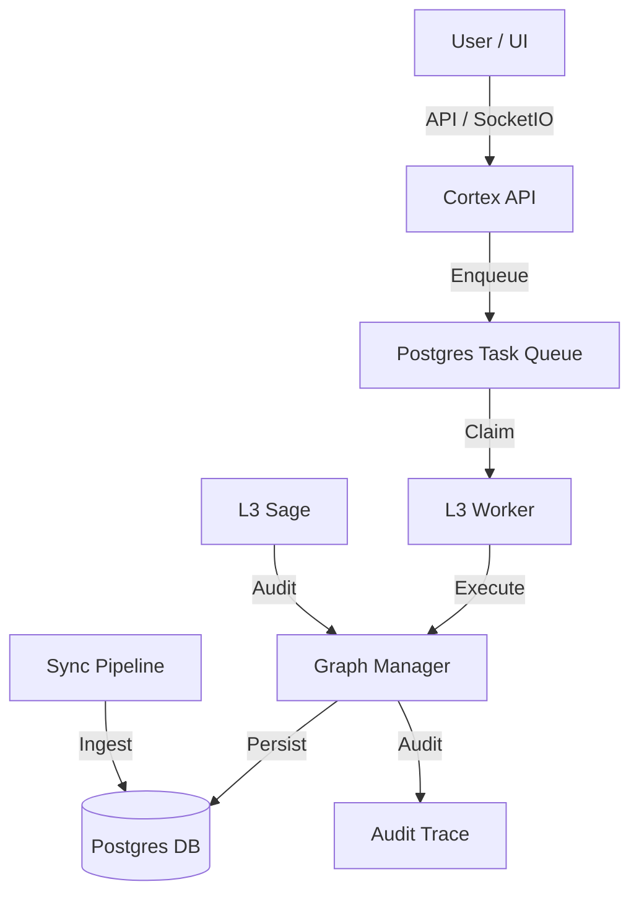

# Nexus Canonical Architecture Overview

## 1. System Identity & Purpose
**Nexus** is a **Cognitive Knowledge Graph** designed to autonomously ingest, structure, and refine unstructured information (conversations, documents) into a coherent, queryable knowledge base. It operates on a **Human-in-the-Loop** model where "Bricks" of information are extracted, validated ("Frozen"), and evolved over time.

The system is architected as a **stateful, event-driven monolith** with clearly defined cognitive layers (L1: Ingestion, L2: Graph, L3: Strategic Audit).

## 2. High-Level Architecture
The system follows a **Service-Oriented** pattern with a shared persistent state (Postgres).

### Core Components
1.  **Cortex API (`services/cortex`)**: The entry point for external interactions. Handles HTTP requests and Real-time events (SocketIO).
2.  **Graph Core (`src/nexus/graph`)**: The central nervous system. Manages the `GraphNode` and `Edge` entities, enforcing strict invariants (cycles, lifecycle monotonicity).
3.  **Cognition Engine (`src/nexus/cognition`)**: The "brain" implementing:
    *   **L3 Sage**: Strategic reflection and system audit.
    *   **Escalation Router**: Cost-aware model selection (Flash vs. Pro).
    *   **Confidence Engine**: Trust scoring for AI outputs.
4.  **Sync Pipeline (`src/nexus/sync`)**: Deterministic ingestion engine that converts raw conversation logs into structured "Source Runs" and "Bricks".
5.  **Task Orchestration (`services/cortex/worker.py`)**: A hardened, Postgres-backed distributed task queue ensuring atomic execution of long-running cognitive tasks.

## 3. Data Flow & State Model
The system uses a **Unified Node Storage** model. Everything is a Node.

*   **Entities**: Intent, Source, Scope, Brick, Topic.
*   **Storage**: All entities reside in `graph.nodes` (JSONB payload).
*   **Relationships**: All connections reside in `graph.edges`.

### Lifecycle State Machine
Entities (specifically Intents/Bricks) move through a strict lifecycle:
`LOOSE` → `FORMING` → `FROZEN` → `SUPERSEDED` | `KILLED`

*   **LOOSE**: Raw, unverified extraction.
*   **FORMING**: Structurally valid, awaiting human/system consensus.
*   **FROZEN**: Immutable truth, used for generation.
*   **SUPERSEDED**: Replaced by a newer version (maintains history).
*   **KILLED**: Explicitly rejected.

## 4. External Surface Map & Dependencies
| Dependency | Usage | Failure Mode |
| :--- | :--- | :--- |
| **Postgres** | Primary Truth, Queue, Vector Data | **Critical**: System Halt. API returns 500. |
| **Redis** | *Implied/Legacy* (Celery) | **Degraded**: Async tasks fail/stall. |
| **OpenAI / LLM** | Cognition (L3 Sage, Extraction) | **Degraded**: Fallback to lower tiers or failure. |
| **FAISS** | Vector Search Index | **Degraded**: Semantic search fails; keyword fallback. |
| **SocketIO** | Real-time Audit/Status | **Minor**: UI updates lag; Core functions persist. |

## 5. Security & Governance
*   **Audit Trace**: Every mutation is logged to `governance.audit_trace` with actor, cost, and reason.
*   **Budget Controller**: Limits token usage per session/period.
*   **Invariants**: Hard-coded checks in `GraphManager` prevent illegal state transitions (e.g., freezing without scope).
