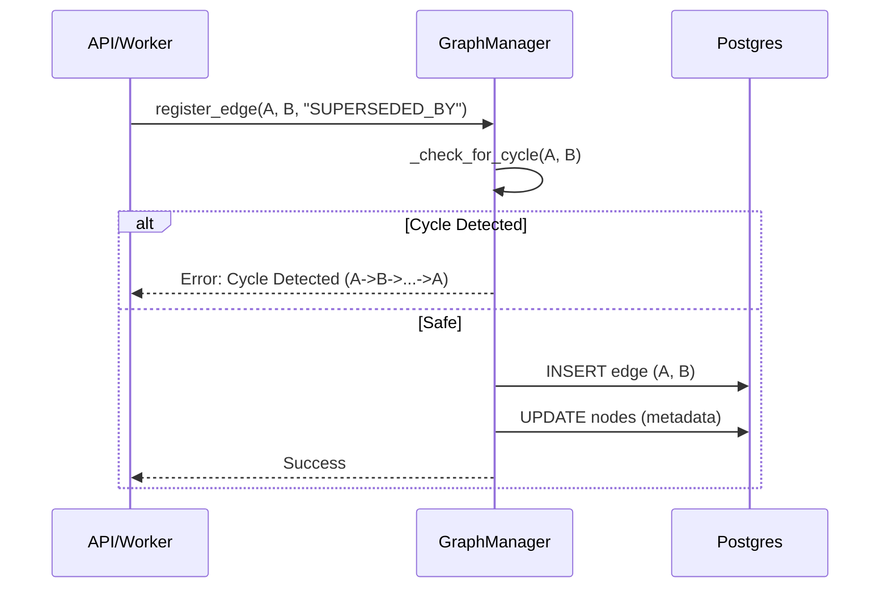
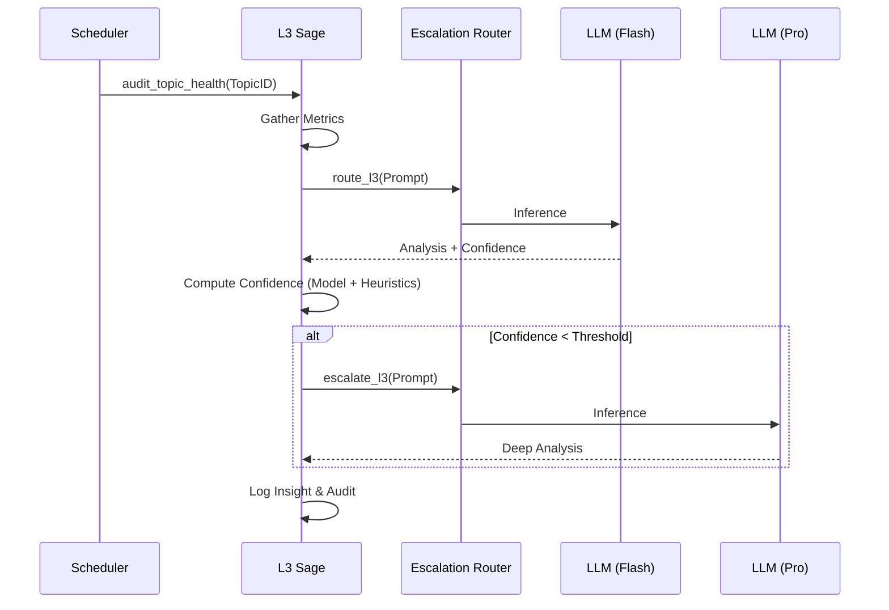
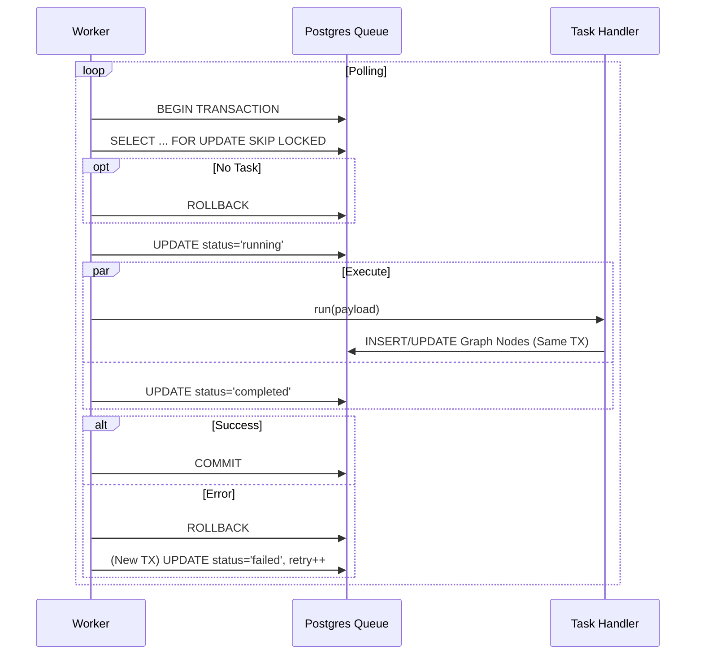

# Module Deep Dives

## 1. Graph Manager (`src/nexus/graph/manager.py`)
**Role**: The "Nervous System" enforcing state integrity and unified storage.

### Core Architecture
The Graph Manager abstracts the underlying Postgres storage (`graph.nodes`, `graph.edges`) into a coherent Object Graph. It is responsible for all state mutations and ensures that no illegal states (e.g., cycles in versioning) are persisted.

### Key Logic: Cycle Detection
Before adding `OVERRIDES` or `SUPERSEDED_BY` edges, the manager performs a DFS traversal to prevent infinite loops.

### Key Logic: Lifecycle Promotion
Promoting a node from `FORMING` to `FROZEN` is a critical boundary crossing.

1.  **Validate Current State**: Node must be `FORMING`.
2.  **Validate Scope (Invariant)**: Node must have an `APPLIES_TO` edge pointing to a Scope.
3.  **Persist**: Update `lifecycle` to `FROZEN`.
4.  **Audit**: Log to `governance.audit_trace`.
5.  **Pulse**: Emit event to L1 Narrator.

## 2. L3 Sage (`src/nexus/cognition/l3_sage.py`)
**Role**: The "Brain" performing strategic audits and high-level reasoning.

### Hybrid Escalation Logic
The Sage uses a "Flash-first, Pro-fallback" strategy to optimize cost vs. intelligence.

## 3. Postgres Worker (`services/cortex/worker.py`)
**Role**: The "Muscle" ensuring reliable, atomic execution of asynchronous tasks.

### Transactional Task Execution
The worker couples the *Task State* (Queue) and *Graph Mutation* (Business Logic) into a single ACID transaction. This ensures that if the business logic fails, the task is not marked as complete, and if the task update fails, the graph is not mutated.

