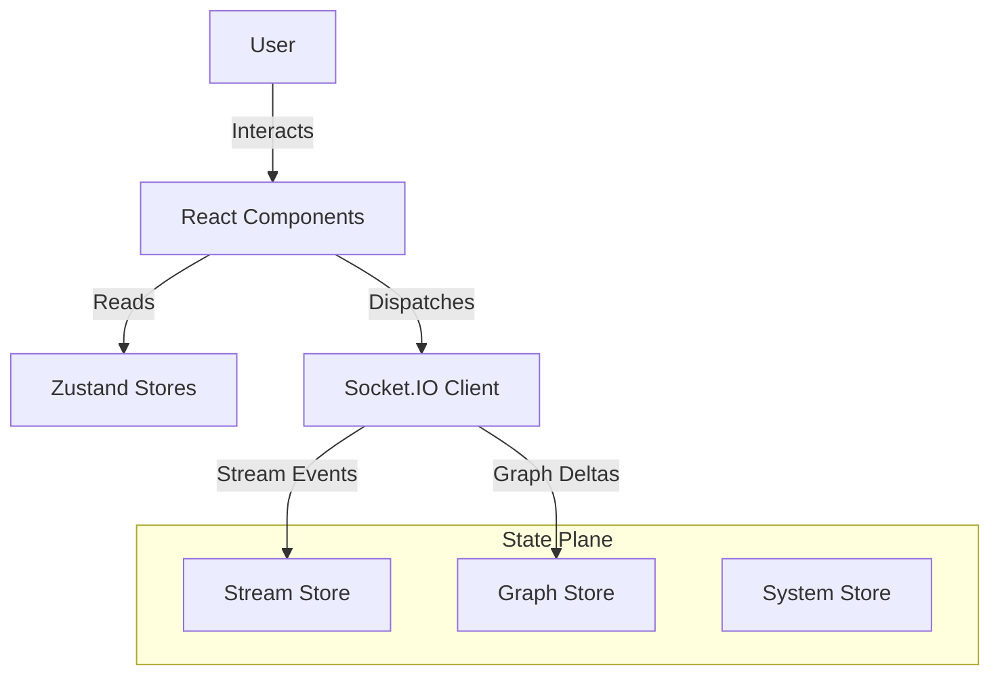

# Nexus UI Canonical Overview

## 1. System Identity & Aesthetic
The **Nexus UI (Jarvis)** is a "Glass-Pane" interface designed for high-density information visualization. It adopts a **Cyberpunk / Sci-Fi HUD** aesthetic ("System_Visualizer_V3") to reflect the system's nature as an autonomous cognitive machine.

*   **Framework**: React 18 + Vite (TypeScript)
*   **State Management**: Zustand (Multi-store architecture)
*   **Styling**: Tailwind CSS + Custom CSS Modules (Scanlines, CRT effects)
*   **Protocol**: WebSockets (Socket.IO) with strict strict Event Envelopes.

## 2. High-Level Architecture
The UI operates as a dumb terminal for the smart backend. It maintains ephemeral state but relies on the backend for all domain truth.

## 3. Core Planes
The UI is divided into three functional planes:

1.  **Navigation Plane (`store.ts`)**: Handles local UI state (Selection, Panel visibility, Modes). Ephemeral.
2.  **Structural Plane (`graph-store.ts`)**: Replicates the backend Graph (Nodes, Edges) for visualization.
3.  **Temporal Plane (`stream-store.ts`)**: Handles the high-frequency Audit Log stream and real-time status updates.

## 4. Visual Intelligence
The UI uses **Cytoscape.js** for graph rendering, enforcing a `Dagre` (Directed Acyclic Graph) layout to visualize the flow of information from `LOOSE` to `FROZEN`.

*   **Nodes**: Rendered with lifecycle-specific styling (Frozen=Blue, Killed=Red).
*   **Edges**: Colored by relationship type (`DERIVED_FROM`, `SUPERSEDES`).

## 5. Protocol Contract
Communication with the backend is strictly typed via `EventEnvelope` (Sequence #, Timestamp, Payload). This allows the UI to detect dropped packets and request delta-resyncs.
