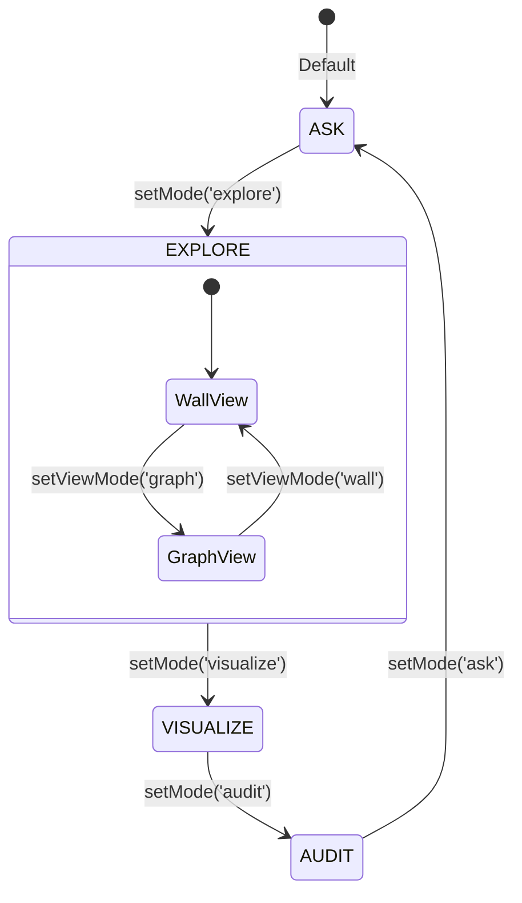
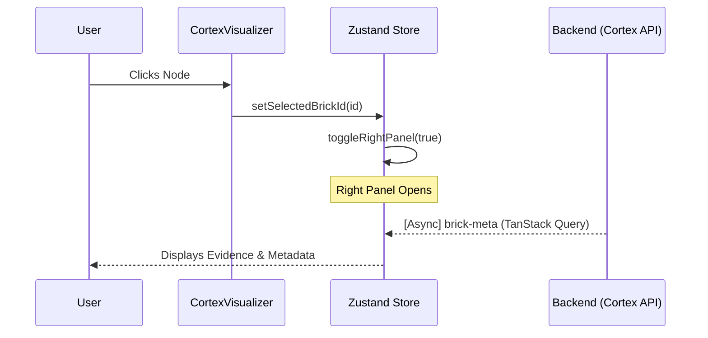

# MODULE_DEEP_DIVES

## 1. App Orchestration (`App.tsx`)
The `App` component acts as the central logic hub, managing navigation modes and high-level data flow between React Query and the visualizers.

### Logical Control Flow
1. **Mount**: Fetches `chat_mapping.json` for ID resolution.
2. **Query**: Triggers `useQuery(['graph-index'])` to fetch the global knowledge state.
3. **Layout**: If in `explore` mode, `getLayoutedElements` uses Dagre to calculate hierarchical positions for nodes.
4. **Interaction**: Selecting a node updates `Zustand` state, which triggers the `Right Panel` (Evidence Viewer) and secondary queries for `brick-meta`.

### Visual Logic: App State Transitions

## 2. Cortex Visualizer (`CortexVisualizer.tsx`)
This module handles the N-dimensional relationship rendering.

### Implementation Detail
- **Graph Library**: Cytoscape.js.
- **Data Transformation**: Converts the backend's flat node/edge list into the `elements` format expected by Cytoscape.
- **Styling**: Uses CSS-like selectors to change node color and size based on the `lifecycle` status (`frozen` = blue, `killed` = red).

### Sequence: Node Selection & Detail Retrieval

## 3. Node Lifecycle Editor (`NodeEditor.tsx`)
A critical "Write Boundary" component that allows human intervention in the knowledge graph.

### Method Intelligence: `onUpdate`
| Property | Value |
|----------|-------|
| **Responsibility** | Orchestrates node state changes in the Graph DB. |
| **Risk Profile** | HIGH: Direct DB Write through API. |
| **Inputs** | `node_id`, `action` ('promote'|'kill'|'supersede'), `data` (reason, new_node_id). |
| **Outputs** | Refreshed Graph Index (via React Query invalidation). |
| **Idempotency** | ✅ Yes: Promoting an already frozen node is a no-op. |
| **State Impact** | Mutates `anchored`, `rejected`, and relationship edges in Graph DB. |
| **Validation** | Ensures `new_node_id` is provided for `supersede` actions. |

## 4. Observatory (`AuditPanel.tsx`)
Provides transparency into the autonomous agent's internal reasoning.

### Data Flow
- **Ingestion**: Polls `/api/audit/events` every 5 seconds.
- **Visualization**: Renders a vertical timeline of `AuditEvent` objects.
- **Deep Dive**: Expanding an event reveals the full `metadata` (JSON), showing token counts, model tiers, and specific decision reasons.
