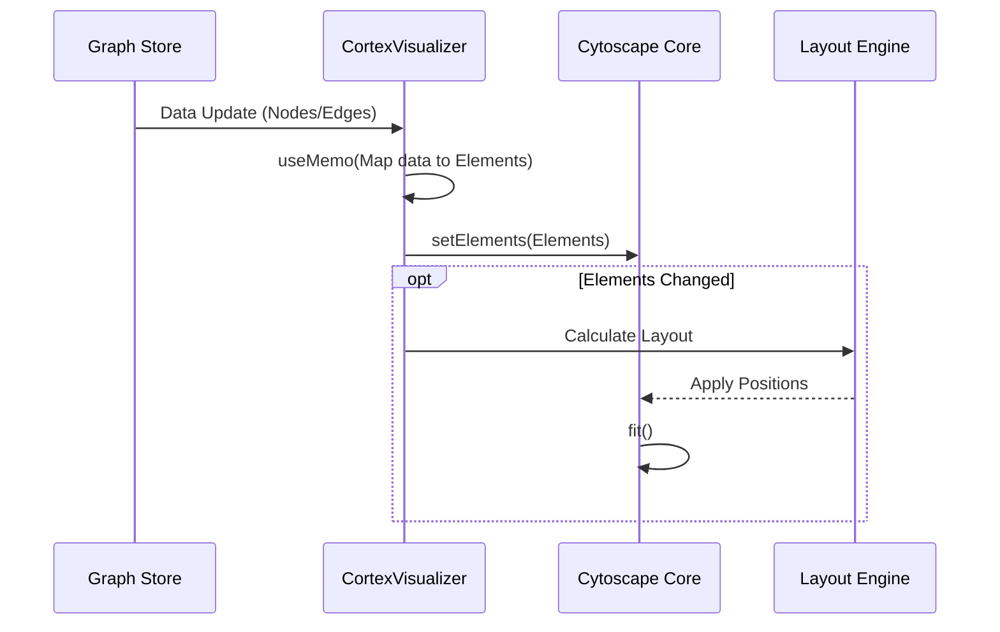
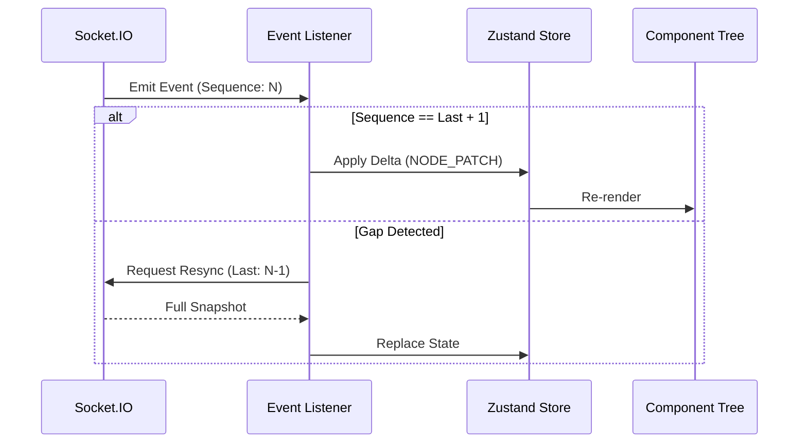

# UI Module Deep Dives

## 1. Cortex Visualizer (`src/components/CortexVisualizer.tsx`)
**Role**: High-performance graph rendering engine.

### Integration Logic
The component bridges the declarative world of React with the imperative DOM manipulation of Cytoscape.js.

```mermaid
sequenceDiagram
    participant Store as Graph Store
    participant React as CortexVisualizer
    participant Cy as Cytoscape Core
    participant Dagre as Layout Engine

    Store->>React: Data Update (Nodes/Edges)
    React->>React: useMemo(Map data to Elements)
    React->>Cy: setElements(Elements)
    
    opt Elements Changed
        React->>Dagre: Calculate Layout
        Dagre-->>Cy: Apply Positions
        Cy->>Cy: fit()
    end
```

### Styling Rules
*   **Default**: `loose` nodes are small circles.
*   **Frozen**: `frozen` nodes are larger squares (blue).
*   **Killed**: `killed` nodes are dim, red-bordered circles.

## 2. Real-Time State Sync (`src/state`)
**Role**: Maintaining synchronization with the authoritative backend.

### The Delta-Sync Pattern
The UI does not poll. It listens for strict event envelopes.

```mermaid
sequenceDiagram
    participant Socket as Socket.IO
    participant Handler as Event Listener
    participant Store as Zustand Store
    participant UI as Component Tree

    Socket->>Handler: Emit Event (Sequence: N)
    
    alt Sequence == Last + 1
        Handler->>Store: Apply Delta (NODE_PATCH)
        Store->>UI: Re-render
    else Gap Detected
        Handler->>Socket: Request Resync (Last: N-1)
        Socket-->>Handler: Full Snapshot
        Handler->>Store: Replace State
    end
```

## 3. Audit Stream Architecture
**Role**: Visualizing high-frequency governance events.

### Virtualization Strategy
Because audit logs can be infinite, the `AuditStreamPanel` uses virtualization (likely `react-window` or `@tanstack/react-virtual` inferred from deps) to render only visible items.

1.  **Ingest**: Socket pushes event to `stream-store` array (capped at e.g., 1000 items).
2.  **Render**: Component reads only the visible slice (e.g., items 900-910).
3.  **Auto-Scroll**: "Stick to bottom" logic unless user scrolls up.
