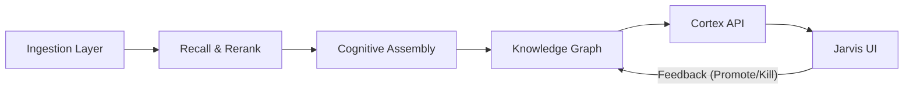

# CANONICAL_OVERVIEW

## 1. System Identity

**Name:** Nexus Cognitive Architecture (v1)
**Purpose:** A monotonic, graph-based knowledge synthesis engine that evolves loose ideas into frozen, authoritative intents through human-in-the-loop governance.
**Core Principle:** "Knowledge is not just stored; it is refined, anchored, and superseded."

## 2. High-Level Architecture

The system operates as a **Unidirectional Data Refining Pipeline**:

### 2.1 Layers

| Layer | Responsibility | Key Components |
|-------|----------------|----------------|
| **Ingestion** | Parses raw chat logs into atomic "Bricks" (context-aware chunks). | `TreeSplitter`, `BrickExtractor` |
| **Vector** | Semantic indexing of Bricks for retrieval. | `LocalIndex` (FAISS), `Embedder` |
| **Cognition** | Synthesizes "Topics" from Bricks using LLMs (DSPy). | `Assembler`, `CognitiveExtractor` |
| **Graph** | Manages the lifecycle of knowledge nodes (Intent, Source, Topic). Enforces invariants. | `GraphManager`, `SQLite` |
| **Service** | Exposes graph operations and data to the UI. | `CortexAPI`, `Flask` |
| **UI** | Visualization and governance interface for the user. | `CortexVisualizer`, `ControlStrip` |

## 3. Core Concepts

### 3.1 The "Brick"
The fundamental unit of raw information. A Brick is a chunk of conversation text, preserving context (previous messages).

### 3.2 The "Intent"
A refined unit of knowledge derived from Bricks. An Intent represents a specific claim, rule, or fact.
- **Lifecycle:** `LOOSE` → `FORMING` → `FROZEN` (or `KILLED`)
- **Monotonicity:** Once `FROZEN`, an Intent cannot be modified, only `SUPERSEDED` by a new Intent.

### 3.3 The "Topic"
A higher-order aggregation of Bricks and Intents related to a specific subject query. Topics serve as entry points for exploration.

### 3.4 Monotonic Conflict Resolution
The system handles conflicting information not by overwriting, but by:
1. **Anchoring:** Older, frozen nodes ("Anchors") resist change.
2. **Supersession:** New information explicitly supersedes old information via graph edges, preserving history.

## 4. Data Flow

1. **Ingest:** Chat logs (`.json`) are split into Trees and then Bricks.
2. **Index:** Bricks are embedded and indexed in FAISS.
3. **Recall:** User queries a Topic. System retrieves relevant Bricks (Recall + Rerank).
4. **Assemble:** `Assembler` uses `CognitiveExtractor` (DSPy) to distill Facts/Diagrams from Bricks.
5. **Graph Update:** 
   - New Artifacts/Intents are created (`FORMING`).
   - Edges link Topics, Artifacts, Intents, and Bricks.
   - High-confidence conflicts with `FROZEN` nodes are resolved (or flagged).
6. **Governance:** User views the Graph via `Jarvis UI`.
   - **Promote:** `LOOSE` → `FORMING`, `FORMING` → `FROZEN`.
   - **Kill:** Reject an Intent (`KILLED`).
   - **Supersede:** Replace an old `FROZEN` node with a new one.

## 5. Technology Stack

- **Language:** Python 3.10+
- **Backend:** Flask
- **Database:** SQLite (Graph Storage), FAISS (Vector Storage)
- **AI/ML:** DSPy (Orchestration), SentenceTransformers (Embedding/Reranking)
- **Frontend:** React, Vite, TailwindCSS, D3.js
