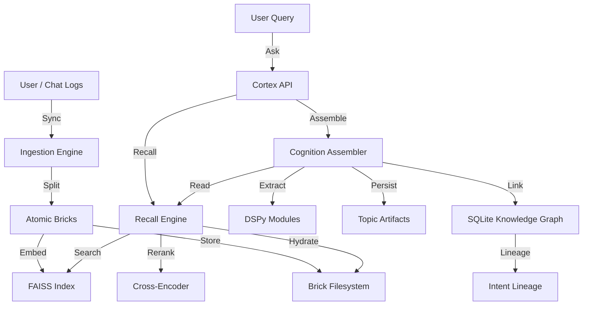

# Nexus Cognitive Memory System — Canonical Overview

## Objective
Nexus is a memory-first cognitive system that ingests conversational data incrementally, preserves all raw information, and assembles lossless topic-level cognition artifacts for consumption by LLM agents and UIs. It operates on the "Mode-1" principle: recall finds locations, but assembly creates knowledge, ensuring provenance is never lost.

## Core Capabilities
- **Incremental Ingestion**: Process new conversation data without reprocessing historical archives.
- **Brick-Based Extraction**: Decompose conversations into atomic, self-contained "bricks" via semantic distillation.
- **Deterministic Topic Assembly**: Synthesize knowledge artifacts (topics) from recalled bricks using DSPy-driven extraction.
- **Graph-Based Traceability**: Link Facts (Intents) back to their source Bricks and Conversations via a Knowledge Graph.
- **Lifecycle Management**: Track the maturity of knowledge from "Loose" observations to "Frozen" system invariants.

## Architectural Doctrine
1.  **Compile, Don’t Summarize**: Do not compress history into lossy vectors. Keep the raw data (Bricks) and index it.
2.  **Recall Finds Locations**: Vector search is only for finding entry points (Bricks).
3.  **Assembly Creates Knowledge**: Cognition happens at read-time (or async assembly time), producing immutable artifacts.
4.  **Monotonic Growth**: New data never invalidates old data; it only supersedes it via explicit graph relationships (OVERRIDES).

## High-Level Architecture

## Data Flow
1.  **Ingest**: Conversations are parsed into Trees, then split into Bricks.
2.  **Index**: Bricks are embedded and added to the Local Vector Index (FAISS).
3.  **Recall**: A query retrieves candidate Bricks (semantic search + reranking).
4.  **Assemble**: 
    - Full source documents are reloaded for candidate Bricks.
    - DSPy extracts structured Facts and Visuals.
    - An immutable JSON Artifact is created.
    - Graph nodes (Topic, Artifact, Intent) are updated.

## Primary Components
| Component | Description | Status |
| :--- | :--- | :--- |
| **Ingestion** | `src/nexus/sync` - Handlers for raw history parsing. | ✅ Active |
| **Brick Store** | `src/nexus/bricks` - Atomic storage of content segments. | ✅ Active |
| **Vector Index** | `src/nexus/vector` - FAISS-based semantic retrieval. | ✅ Active |
| **Recall** | `src/nexus/ask` - Orchestration of search and reranking. | ✅ Active |
| **Cognition** | `src/nexus/cognition` - LLM-based logic (DSPy) for assembly. | ✅ Active |
| **Graph** | `src/nexus/graph` - SQLite-based relationship tracking. | ✅ Active |
| **Cortex** | `services/cortex` - API gateway and orchestration layer. | ✅ Active |

## Storage Strategy
- **Raw Data**: JSON files on disk (`d:/chatgptdocs/data`).
- **Vectors**: Local FAISS index file.
- **Graph**: Local SQLite database (`graph.db`).
- **Artifacts**: JSON files in `output/artifacts`.
