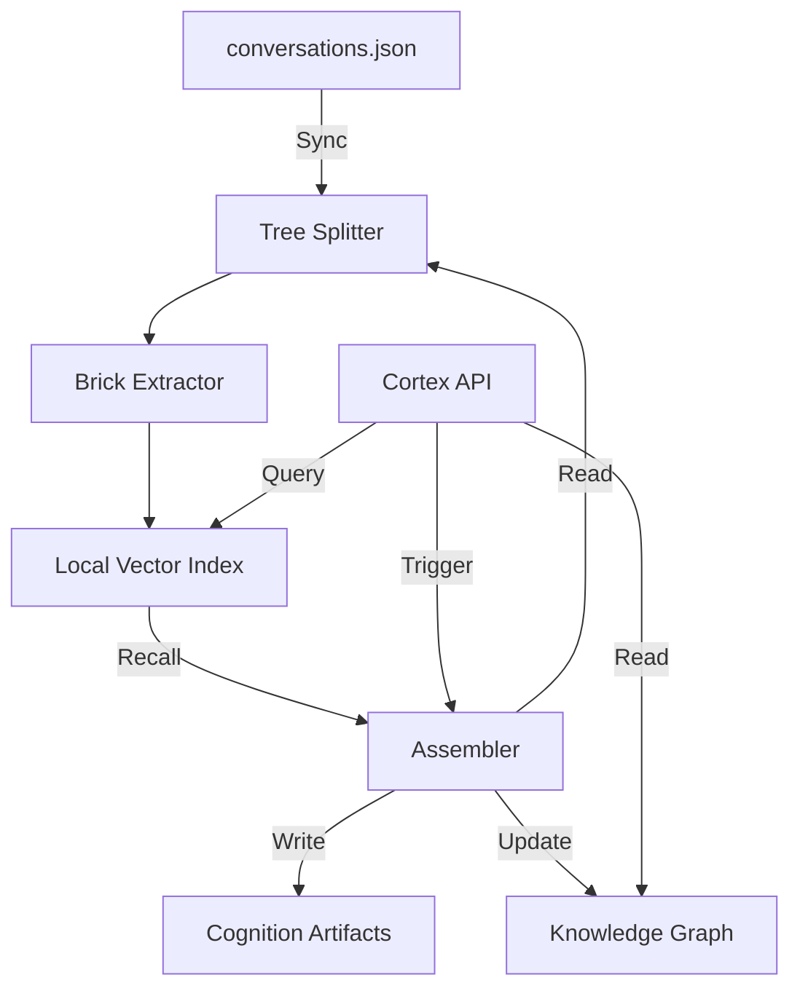

# Canonical Overview: Nexus Cognitive Backbone

## System Identity
**Nexus** is a local-first, privacy-centric cognitive architecture designed to ingest conversational memory, fragment it into atomic units ("Bricks"), embed them for semantic retrieval, and reassemble them into structured knowledge artifacts ("Topics") via a graph-augmented cognition engine. It serves as the backend for "Jarvis", a UI interface for knowledge interaction.

## Core Architecture

### 1. Ingestion & Fragmentation Pipeline (Sync)
The entry point is a massive dump of conversational history (`conversations.json`).
- **Tree Splitting**: Raw JSON is split into individual conversation trees.
- **Brick Extraction**: Trees are traversed to extract atomic blocks of text (Bricks) based on message boundaries and paragraph delimiters.
- **Wall Building**: Bricks are aggregated into "Walls" (intermediate storage structures).

### 2. Vector Memory System
- **Embedding**: Bricks are embedded using `sentence-transformers` (384d vectors).
- **Indexing**: Embeddings are stored in a local FAISS index (`index.faiss`).
- **Metadata**: A parallel JSON store (`brick_ids.json`) maps index positions to Brick IDs and source metadata.

### 3. Cognition Engine (Assembler)
The "Brain" of the system, capable of synthesizing new knowledge artifacts.
- **Recall**: Retrieves relevant Bricks using vector similarity (`recall_bricks_readonly`).
- **Expansion**: Resolves Bricks back to their original source files to gather full context.
- **Deduplication**: Uses content hashing to merge identical source documents.
- **Assembly**: Constructs a structured JSON artifact containing the query, provenance, raw excerpts, and coverage status.
- **Persistence**: Saves artifacts to disk with content-addressable filenames.

### 4. Knowledge Graph
A lightweight, JSON-based graph database (`nodes.json`, `edges.json`) that tracks relationships:
- **Topics** ↔ **Artifacts** (`ASSEMBLED_IN`)
- **Artifacts** ↔ **Bricks** (`DERIVED_FROM`)
- **Anchors**: User-defined overrides for relevance (promote/reject).

### 5. Cortex API (Service Layer)
A Flask-based REST API exposing the system to the frontend.
- **Endpoints**: `/jarvis/assemble-topic`, `/jarvis/graph-index`, `/jarvis/brick-full`.
- **Role**: Read-only access to memory + Triggering assembly tasks + Graph manipulation.

## Data Flow

## Primary Design Principles
1. **Source of Truth**: The raw conversation trees on disk are the ultimate source of truth. Bricks are derived views.
2. **Content Addressing**: Artifacts and documents are identified by content hashes to ensure idempotency.
3. **Local-First**: All data (vectors, graph, files) resides locally; no external cloud dependencies required for core function.
4. **Traceability**: Every generated artifact must maintain strict provenance links back to the original source message and span.
