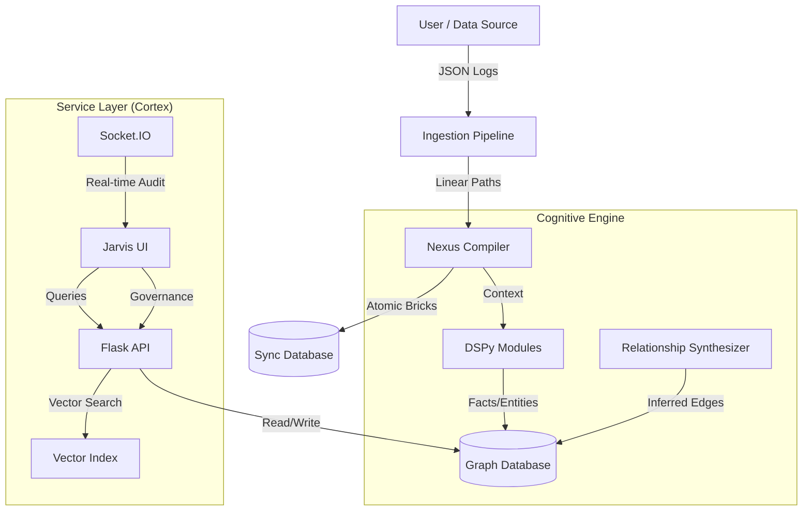

# Canonical Overview: Nexus Cognitive Architecture

## 1. System Philosophy
Nexus is a **Hybrid Cognitive Architecture** designed to autonomously ingest unstructured conversational data, extract atomic knowledge units ("Bricks"), and synthesize a structured Knowledge Graph of **Intents**, **Facts**, and **Relationships**. It bridges the gap between raw LLM interactions and a persistent, queryable memory system.

## 2. High-Level Architecture

```mermaid
graph TD
    User[User / Data Source] -->|JSON Logs| Ingest[Ingestion Pipeline]
    Ingest -->|Linear Paths| Compiler[Nexus Compiler]
    Compiler -->|Atomic Bricks| Vault[(Sync Database)]
    
    subgraph "Cognitive Engine"
        Compiler -->|Context| DSPy[DSPy Modules]
        DSPy -->|Facts/Entities| GraphDB[(Graph Database)]
        Synthesizer[Relationship Synthesizer] -->|Inferred Edges| GraphDB
    end
    
    subgraph "Service Layer (Cortex)"
        API[Flask API] -->|Read/Write| GraphDB
        API -->|Vector Search| FAISS[Vector Index]
        Socket[Socket.IO] -->|Real-time Audit| UI[Jarvis UI]
    end
    
    UI -->|Queries| API
    UI -->|Governance| API
```

## 3. Core Subsystems

### A. Ingestion & Synchronization (`src/nexus/sync`)
The entry point for data. It deterministically processes conversation logs into "Source Runs".
-   **Responsibility**: Parsing JSON, splitting linear paths via `TreeSplitter`, and compiling raw text into "Bricks".
-   **Key Components**: `Runner`, `Compiler`, `SyncDatabase`.

### B. Cognition & Extraction (`src/nexus/cognition`)
The "Brain" of the system. Uses **DSPy** to perform structured extraction from unstructured text.
-   **Responsibility**: Extracting Facts, Diagrams, and Entities. synthesizing relationships between Intents.
-   **Key Components**: `CognitiveExtractor`, `RelationshipSynthesizer`, `DSPy Modules`.

### C. Graph Management (`src/nexus/graph`)
The persistent memory. Manages the lifecycle of knowledge nodes.
-   **Responsibility**: Storage, retrieval, and governance of the Knowledge Graph.
-   **Key Components**: `GraphManager`, `Schema`, `Projection`.
-   **Governance**: `PromptManager` ensures only approved prompts are used.

### D. Cortex Service (`services/cortex`)
The nervous system. Exposes the architecture via a RESTful API and WebSocket stream.
-   **Responsibility**: API endpoints for UI, real-time audit logging, and task orchestration.
-   **Key Components**: `Server`, `API`, `Worker` (Celery).

## 4. External Surface Map & Dependencies

| Dependency | Purpose | Failure Mode | Impact |
| :--- | :--- | :--- | :--- |
| **Flask** | HTTP API Server | **CRITICAL** | API becomes unreachable. System outage. |
| **Socket.IO** | Real-time Audit Streaming | **Degraded** | UI updates lag, but core logic works. |
| **FAISS** | Vector Similarity Search | **Degraded** | "Recall" features fail; Graph traversal still works. |
| **Redis** | Celery Broker / Cache | **Degraded** | Async tasks (Assembly) fail; Sync mode fallback available. |
| **Celery** | Distributed Task Queue | **Degraded** | Background processing stops; System must run synchronously. |
| **LLM (llama-cpp)** | Intelligence (Reranking) | **Degraded** | Reranking falls back to vector scores. Quality drops, but functions. |
| **LLM (Ollama/OpenAI)**| Intelligence (Extraction) | **CRITICAL** | Cognition and Compilation completely stop. |
| **SQLite** | Persistence (`graph.db`, `sync.db`) | **CRITICAL** | Data loss or corruption if file locking fails. |

## 5. Data Flow & Lifecycle

1.  **Ingestion**: `JSON Logs` -> `Tree Splitter` -> `Path Hash` -> `Source Run` -> `Vault`.
2.  **Compilation**: `Source Run` -> `Nexus Compiler` -> `Bricks` (Atomic Units).
3.  **Graph Construction**: `Bricks` -> `Graph Manager` -> `Nodes` (Intent, Source, Scope).
4.  **Synthesis**: `Nodes` -> `Relationship Synthesizer` -> `Edges` (Derived From, Conflicts With).
5.  **Access**: `UI/API` -> `Graph Query` / `Vector Search` + `Reranking` -> `Response`.

## 6. Security & Governance
-   **Audit Trail**: All state changes are logged to `phase3_audit_trace.jsonl`.
-   **Alerts**: `AlertManager` tracks coverage gaps and prompt performance.
-   **Prompts**: `PromptManager` enforces use of approved system prompts.
-   **Anchoring**: Human-in-the-loop validation allows "Anchoring" (approving) or "Rejecting" nodes.
