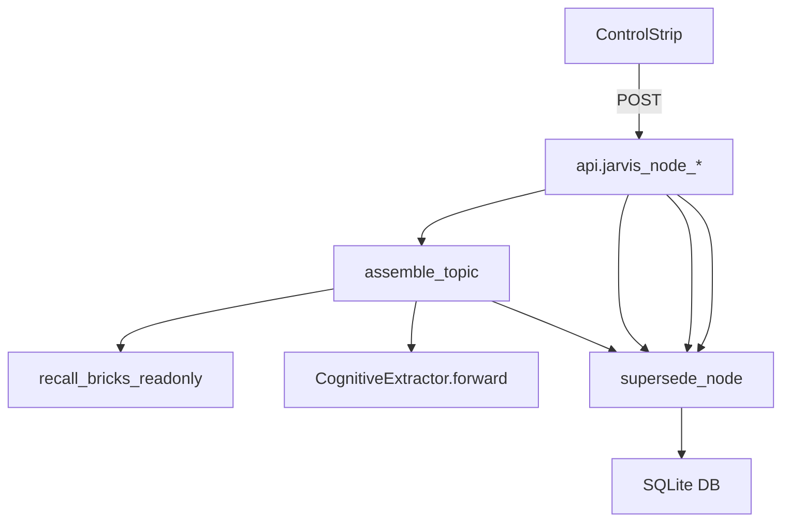

# IMPLEMENTATION_REALITY_MAP

## 1. Overview
This document maps the architectural ideal to the current codebase reality.

**Legend:**
- ✅ **Implemented:** Fully functional and aligned with architecture.
- 🟡 **Partial:** Implemented but missing features or refinement.
- 🔴 **Missing:** Not present in the codebase.
- 🧪 **Mocked/Experimental:** Present but not production-ready.

## 2. Component Status

### 2.1 Ingestion Layer
| Component | Status | Notes |
|-----------|--------|-------|
| `TreeSplitter` | ✅ | Splits conversation JSONs into trees. |
| `BrickExtractor` | ✅ | Context-aware chunking works. |
| `PromptExtractor` | 🟡 | Basic regex/logic, needs more sophistication. |

### 2.2 Vector Layer
| Component | Status | Notes |
|-----------|--------|-------|
| `Embedder` | ✅ | Uses `SentenceTransformers` (all-MiniLM-L6-v2). |
| `LocalIndex` | ✅ | FAISS implementation is solid for local usage. |
| `Recall` | ✅ | `recall_bricks_readonly` functional. |

### 2.3 Cognition Layer
| Component | Status | Notes |
|-----------|--------|-------|
| `Assembler` | ✅ | Orchestrates recall, extraction, and graph updates. |
| `CognitiveExtractor` | 🟡 | DSPy modules exist but error handling is basic. |
| `TopicResolution` | 🟡 | Simple slug-based resolution, needs semantic clustering. |

### 2.4 Graph Layer
| Component | Status | Notes |
|-----------|--------|-------|
| `GraphManager` | ✅ | SQLite-based, handles nodes and edges. |
| `Schema` | ✅ | `IntentLifecycle`, `EdgeType` defined. |
| `ConflictResolution` | 🟡 | Basic monotonic logic (Frozen vs Forming) exists but needs rigorous testing. |
| `Auditing` | 🟡 | `_log_audit_event` prints to console, needs persistent log file. |

### 2.5 Service Layer
| Component | Status | Notes |
|-----------|--------|-------|
| `CortexAPI` | ✅ | Wrapper around backend logic. |
| `Server` | ✅ | Flask routes for graph, anchoring, and assembly. |
| `Authentication` | 🔴 | No auth on API endpoints. |

### 2.6 UI Layer
| Component | Status | Notes |
|-----------|--------|-------|
| `CortexVisualizer` | ✅ | D3.js force-directed graph works. |
| `ControlStrip` | ✅ | Lifecycle actions (Promote, Kill) wired to API. |
| `NexusNode` | ✅ | Visual styling for lifecycles (`LOOSE`, `FORMING`, `FROZEN`) implemented. |
| `WallView` | 🟡 | Basic implementation, likely needs more features. |

## 3. Class -> Method Intelligence

### 3.1 `nexus.graph.manager.GraphManager`
| Method | Status | Responsibility |
|--------|--------|----------------|
| `register_node` | ✅ | Upserts nodes into SQLite. |
| `register_edge` | ✅ | Upserts edges, checks duplicates. |
| `promote_node_to_frozen` | ✅ | Transitions `FORMING` -> `FROZEN`, logs audit. |
| `kill_node` | ✅ | Transitions any -> `KILLED`, logs audit. |
| `supersede_node` | ✅ | Links old `FROZEN` to new `FROZEN` via `SUPERSEDED_BY`. |
| `get_intents_by_topic` | ✅ | Retrieves intents for a topic slug. |
| `_log_audit_event` | 🟡 | Currently just prints to stdout. |

### 3.2 `nexus.cognition.assembler` (Module Level)
| Method | Status | Responsibility |
|--------|--------|----------------|
| `assemble_topic` | ✅ | Main pipeline: Recall -> Extract -> Graph Linkage. |
| `_calculate_content_hash` | ✅ | Content-addressable hashing. |
| `_get_slug` | ✅ | Simple string slugification. |

### 3.3 `nexus.cognition.dspy_modules.CognitiveExtractor`
| Method | Status | Responsibility |
|--------|--------|----------------|
| `forward` | 🟡 | Runs DSPy ChainOfThought for Facts and Diagrams. Needs retry logic. |

## 4. Method Usage Graph

