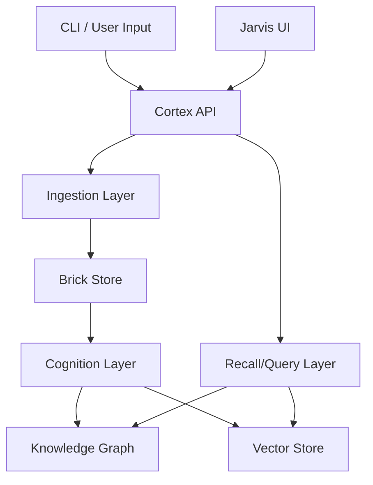

# Nexus - Knowledge Transfer (KT) Document

## 1. System Overview

**Nexus** is a memory-first cognitive system designed to ingest conversational data incrementally, preserve raw information, and assemble lossless topic-level cognition artifacts. Unlike traditional RAG systems, it emphasizes "compiling" knowledge into a structured graph rather than just retrieving raw chunks.

### Core Philosophy
- **Incremental Ingestion**: New data is added without reprocessing old data.
- **Brick-based Memory**: Information is extracted into atomic units called "Bricks".
- **Deterministic Assembly**: Knowledge is assembled into a graph structure deterministically (MODE-1).
- **Immutable Artifacts**: Once "Frozen", knowledge nodes are immutable.

## 2. Architecture High-Level Map

The system is layered into distinct functional areas that pipeline data from raw input to synthesized knowledge.



### Key Components

1.  **Cortex (Services Layer)**
    *   **Role**: The central nervous system handling API requests, orchestration, and background tasks.
    *   **Location**: `services/cortex/`
    *   **Key Files**: `api.py` (Entry point), `orchestration.py` (Workflow logic), `worker.py` (Celery tasks).

2.  **Sync (Ingestion Layer)**
    *   **Role**: Handles the raw ingestion of data (e.g., chat logs, documents). It splits data into trees and manages incremental updates.
    *   **Location**: `src/nexus/sync/`
    *   **Key Files**: `runner.py` (Main execution loop), `compiler.py`.

3.  **Cognition (Processing Layer)**
    *   **Role**: The "brain" that turns raw data into structured knowledge. It extracts "Bricks", synthesizes relationships, and manages the lifecycle of knowledge nodes.
    *   **Location**: `src/nexus/cognition/`
    *   **Key Files**: `assembler.py`, `synthesizer.py`, `l3_sage.py` (Advanced reasoning), `confidence_engine.py`.

4.  **Graph (Storage Layer)**
    *   **Role**: Stores the structured knowledge as Nodes and Edges with strict lifecycle states.
    *   **Location**: `src/nexus/graph/`
    *   **Key Files**: `manager.py`, `schema_*.sql`.
    *   **Backend**: PostgreSQL (relational + graph-like schema).

5.  **Vector (Recall Layer)**
    *   **Role**: Semantic search capability.
    *   **Location**: `src/nexus/vector/`
    *   **Key Files**: `embedder.py`, `vector_store.py`.
    *   **Backend**: FAISS (typically).

6.  **Jarvis (UI Layer)**
    *   **Role**: A "Hybrid" control panel and exploration tool. It mirrors the backend architecture, allowing visualization of ingestion, cognition, and the knowledge graph.
    *   **Location**: `ui/jarvis/`
    *   **Stack**: React, Vite, Tailwind.

## 3. Data Flow & Lifecycle

Data in Nexus moves through specific stages, enforced by system invariants.

1.  **Ingestion**: Raw text -> **Source Run** -> **Bricks**
2.  **Formation**: Bricks -> **Loose Nodes** (Candidate knowledge)
3.  **Synthesis**: Loose Nodes -> **Forming Nodes** (Being connected)
4.  **Freezing**: Forming Nodes -> **Frozen Nodes** (Immutable, trusted knowledge)
    *   *Note*: Nodes can also be **Superseded** (updated version) or **Killed** (rejected).

## 4. Key Workflows

### A. Ingestion Run
Triggered via CLI or API.
1.  `src/nexus/sync/runner.py` starts.
2.  Reads source data.
3.  Computes content hashes to identify new/changed content.
4.  Splits content into trees.
5.  Extracts atomic "Bricks" from new content.

### B. Cognitive Synthesis
Background process (Celery).
1.  `src/nexus/cognition/synthesizer.py` picks up loose bricks/nodes.
2.  Uses LLM (via `services/cortex/orchestration.py`) to determine relationships.
3.  Updates the Graph with new Nodes and Edges.
4.  Promotes nodes through lifecycle states (Loose -> Frozen).

### C. Query / Recall
1.  User asks a question via UI/API.
2.  `src/nexus/ask/recall.py` (or similar) is invoked.
3.  **Vector Search**: Finds relevant nodes via embedding similarity.
4.  **Graph Traversal**: Expands context using graph edges.
5.  **LLM Synthesis**: Generates an answer based on retrieved context.

## 5. Setup & Development

### Prerequisites
- Python 3.11+
- Node.js 20+
- PostgreSQL
- Redis (for Celery queues)

### Backend Setup
```bash
# Install dependencies
pip install -r requirements.txt

# Database Migration (Schema application)
python scripts/apply_cognition_schema_v2.py

# Other Schema Patches:
# - python scripts/apply_cognition_schema.py      # Base cognition schema
# - python scripts/apply_cognition_schema_v2.py   # V2 cognition schema upgrade
# - python scripts/apply_evolution_schema.py      # Evolution V2 schema (Archival, Concepts, MVs)
# - python scripts/apply_l3_schema.py             # L3 queue schema

# Run API
python services/cortex/server.py
```

### Frontend Setup
```bash
cd ui/jarvis
npm install
npm run dev
```

### Docker
The system is containerized.
`docker-compose up --build` will launch DB, Redis, API, and UI.

## 6. Important Locations & Debugging

- **Logs**: `logs/` directory contains component-specific logs (e.g., `cortex_*.log`, `sync_*.log`).
- **Database Schema**: Defined in `src/nexus/db/models.py` (SQLAlchemy) and `src/nexus/graph/schema_*.sql`.
- **Architecture Docs**: 
    - `Architecture/Backend/` - Detailed backend specs.
    - `Architecture/UI/` - UI specs.
    - `NEXUS_COGNITIVE_PLAN_v1/` - Core cognitive logic design.

## 7. Known Invariants & Rules

- **Immutable History**: Never delete old source runs; strictly additive.
- **Graph Integrity**: A "Frozen" node cannot be modified, only superseded.
- **Traceability**: Every node must trace back to a Source Run (provenance).

## 8. Troubleshooting Common Issues

- **Sync Stuck**: Check `nexus_sync.source_runs` for failed states. Reset using `scripts/reset_sync.py` if safe/necessary.
- **Missing Knowledge**: Check `nexus_graph.nodes` lifecycle state. If "LOOSE", it hasn't been synthesized yet. Trigger synthesis.
- **LLM Errors**: Check `services/cortex/proxy_config.yaml` or `.env` for API key issues.
