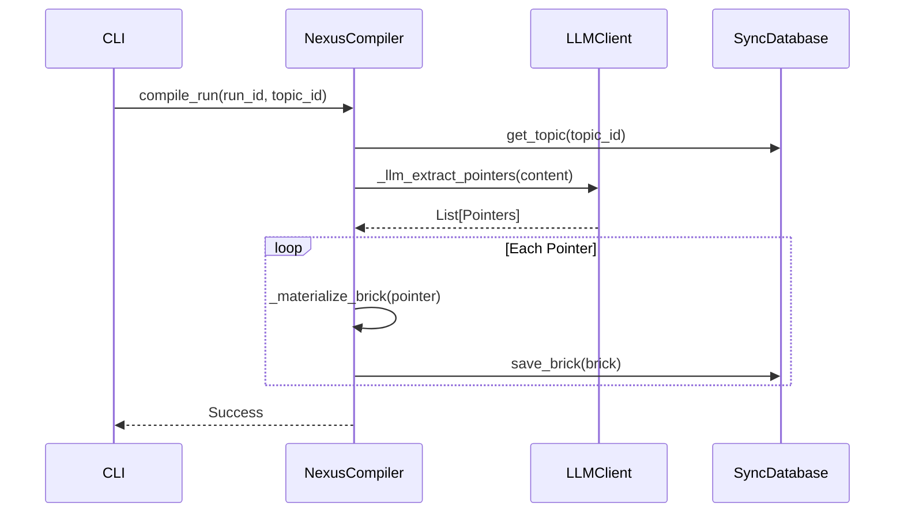
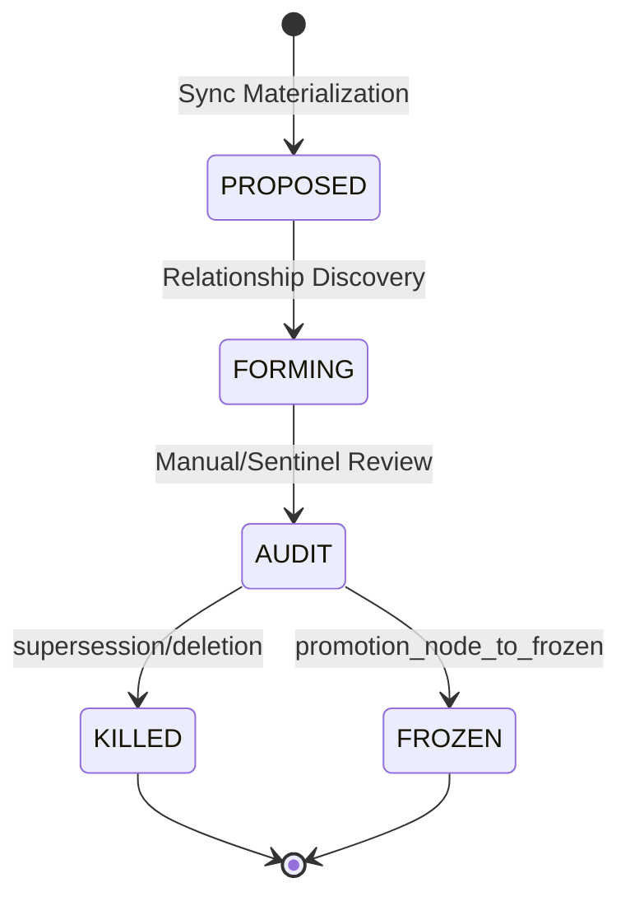

# Nexus: Module Deep Dives

## 1. Sync & Materialization Pipeline
The Sync module is responsible for the transition from unstructured conversation history to atomic "Bricks."

### Logic Flow: NexusCompiler
1. **Ingest**: Reads raw JSON conversation threads.
2. **Pre-filter**: Uses topic definitions to identify relevant message ranges.
3. **Extraction**: `_llm_extract_pointers` identifies specific knowledge nuggets.
4. **Materialization**: `_materialize_brick` creates a JSON artifact containing text, metadata, and provenance.
5. **Persistence**: `SyncDatabase.save_brick` stores the artifact.

## 2. Graph Governance & Lifecycle
The `GraphManager` acts as the authority for the system's state. It enforces invariants like cycle detection and lifecycle gatekeeping.

### Method Intelligence: GraphManager
| Method | Responsibility | Risk | Idempotency | State Impact |
|--------|----------------|------|-------------|--------------|
| `promote_node_to_frozen` | Transitions an Intent to immutable production state. | HIGH | ✅ Yes | `lifecycle` -> FROZEN |
| `register_edge` | Connects two nodes; runs cycle detection. | HIGH | ❌ No | Adds edge record |
| `supersede_node` | Replaces an old node with a new version, linking them via SUPERSEDES edge. | HIGH | ❌ No | Mutates 2 nodes |
| `sync_bricks_to_nodes` | Batch creates Source/Intent nodes from materialized bricks. | MED | ✅ Yes | Bulk node insertion |

## 3. Cognitive Synthesis (DSPy)
Cognition is the "brain" of Nexus, synthesizing higher-order relationships from atomic bricks.

### Logic Flow: RelationshipSynthesizer
1. **Fetch**: Retrieves all `PROPOSED` or `FORMING` intents for a topic.
2. **DSPy Forward**: The `RelationshipSynthesizer` module compares intent pairs.
3. **Reasoning**: Identifies `DEPENDS_ON`, `CONFLICTS_WITH`, or `RELATES_TO` relationships.
4. **Apply**: Writes the discovered edges back to the `GraphManager`.

## 4. Cortex Orchestration
Cortex is the service layer that exposes the graph's capabilities to agents and users.

### Method Intelligence: CortexAPI
| Method | Responsibility | Risk | Idempotency | State Impact |
|--------|----------------|------|-------------|--------------|
| `route` | Determines which agent/sub-system should handle a query. | HIGH | ✅ Yes | None (Read-thru) |
| `assemble` | Triggers the full synthesis pipeline for a specific topic query. | HIGH | ❌ No | Mutates Graph |
| `trigger_self_healing` | (IMPLIED) Analyzes graph for conflicts and auto-resolves via supersession. | HIGH | 🧪 Mock | Graph Cleanup |
