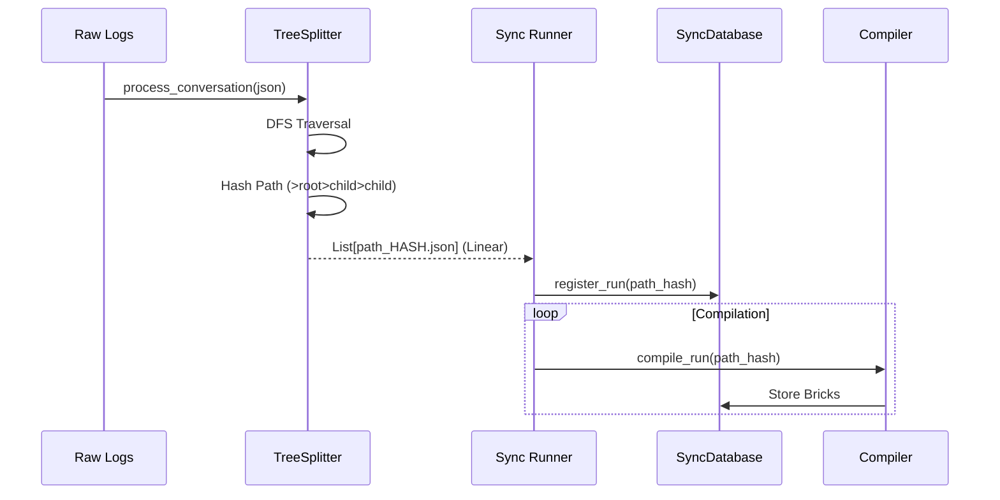
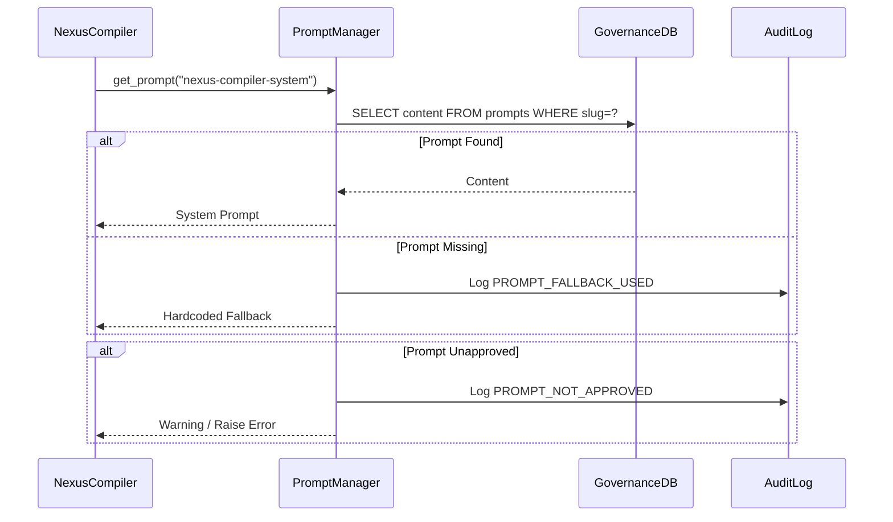
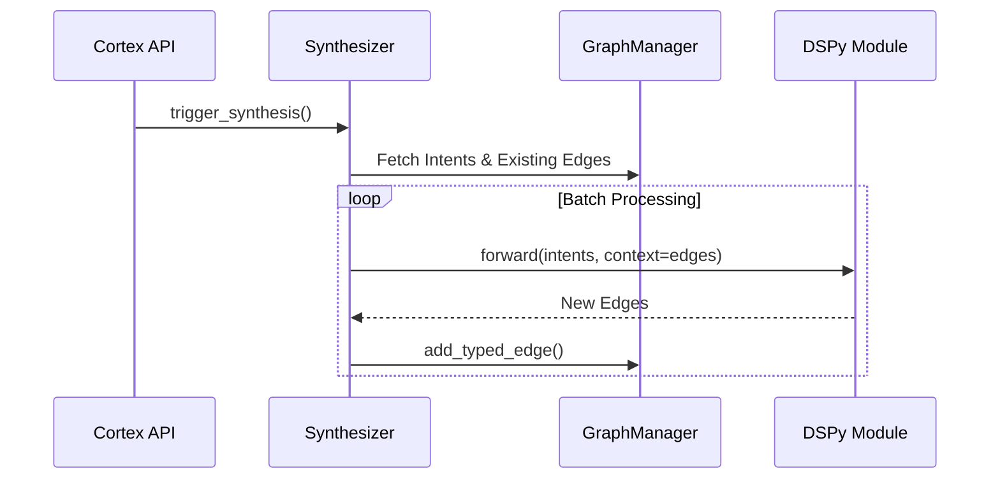

# Module Deep Dives

## 1. Rich Ingestion Pipeline (`src/nexus/extract` & `src/nexus/sync`)

The Ingestion Pipeline transforms hierarchical conversation trees into linear, path-stable "Source Runs".

### Control Flow

### Key Logic
-   **Path Hashing**: `path_id = hashlib.sha256(">".join(path))` ensures that if a conversation branch remains unchanged, its ID remains stable, allowing for (future) incremental sync.
-   **Rich Content**: The `extract_message` function handles code blocks and tool outputs, preserving them as structured `content_blocks` in the Source Run.

## 2. Governance & Prompt Management (`src/nexus/graph/prompt_manager.py`)

This module enforces safety rails around the system prompts used by the Compiler and Synthesizer.

### Control Flow

### Key Logic
-   **Governance Violation**: A specific exception type raised when critical prompts are missing and no fallback is safe.
-   **Versioning**: All prompts are versioned in the DB. The system defaults to the latest version but can request specific ones for reproducibility.

## 3. Cognitive Synthesis Engine (`src/nexus/cognition`)

Background process for discovering relationships.

### Control Flow

