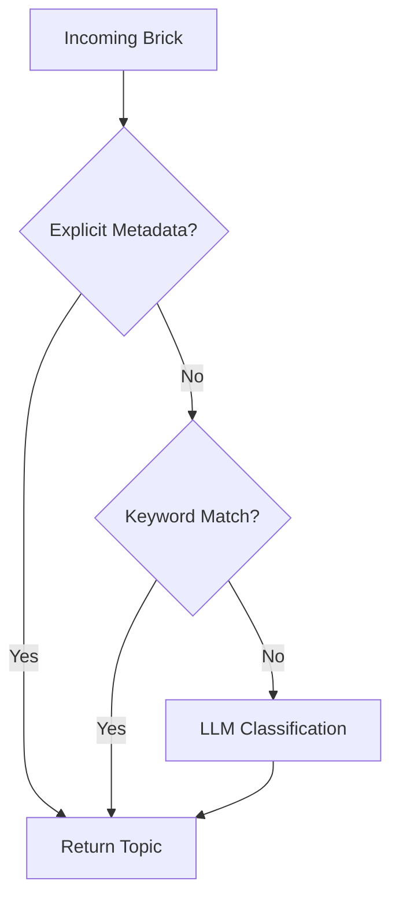

# MODULE DEEP DIVES

## 1. Topic Router (`src/nexus/sync/router.py`)

### 1.1 Responsibility
Classifies incoming Bricks into a `TopicID`. This is the first layer of cognition, effectively deciding "which filing cabinet" a piece of information belongs to.

### 1.2 Control Flow
1.  **Input:** `Brick` (Content + Metadata).
2.  **Step 1:** Check if `Brick` has explicit metadata overriding routing.
3.  **Step 2 (Fast Path):** Keyword/Regex match against known high-confidence topics (e.g., "SQL Error" -> `TopicID.ENGINEERING`).
4.  **Step 3 (Slow Path):** Call LLM with a classification prompt.
5.  **Step 4:** Return `TopicID`.

### 1.3 Visual Logic

## 2. Cognitive Compiler (`src/nexus/sync/compiler.py`)

### 2.1 Responsibility
Aggregates loose Bricks within a Topic into structured Nodes. It acts as a "synthesizer," turning raw chat logs into coherent documentation concepts.

### 2.2 Control Flow
1.  **Input:** `TopicID`.
2.  **Step 1:** Fetch all `Status: EMBEDDED` Bricks for this Topic.
3.  **Step 2:** Cluster Bricks using Vector similarity (DBSCAN/K-Means).
4.  **Step 3:** For each cluster, generate a summary Node using LLM.
5.  **Step 4:** Create `Node` in Graph DB.
6.  **Step 5:** Link original Bricks to new `Node` (Edges).

## 3. Entity Resolver (`src/nexus/cognition/entity_resolver.py`)

### 3.1 Responsibility
Identifies and merges duplicate Nodes. For example, ensuring "Postgres" and "PostgreSQL" are treated as the same entity.

### 3.2 Control Flow
1.  **Input:** Two candidate Nodes (`A`, `B`).
2.  **Step 1:** Comparison vector similarity check (> 0.95 cosine).
3.  **Step 2:** LLM verification ("Are these the same thing?").
4.  **Step 3:** If Match -> Merge (Update all edges from B to A, delete B).
5.  **Step 4:** If No Match -> Mark as `DISTINCT` to prevent re-checking.

## 4. Promotion Engine (`src/nexus/evolution/promotion_engine.py`)

### 4.1 Responsibility
Moves Nodes up the hierarchy from "Raw Observation" to "Verified Fact" to "Core Principle."

### 4.2 Logic
*   **Rule 1:** A Node needs > 5 linked Bricks to be promoted to `Level 1`.
*   **Rule 2:** A Node needs manual user validation (Human-in-the-loop) for `Level 2`.
*   **Rule 3:** Nodes that contradict existing `Level 2` nodes trigger an "Anomaly" alert.
