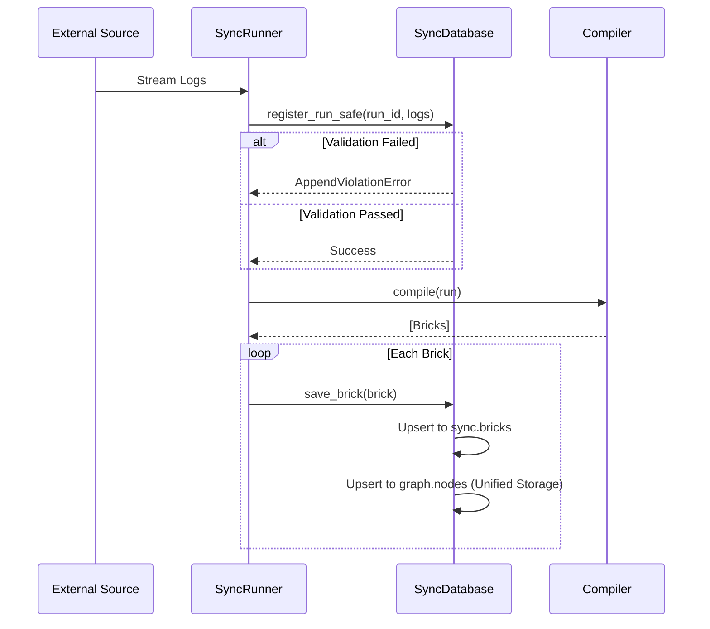
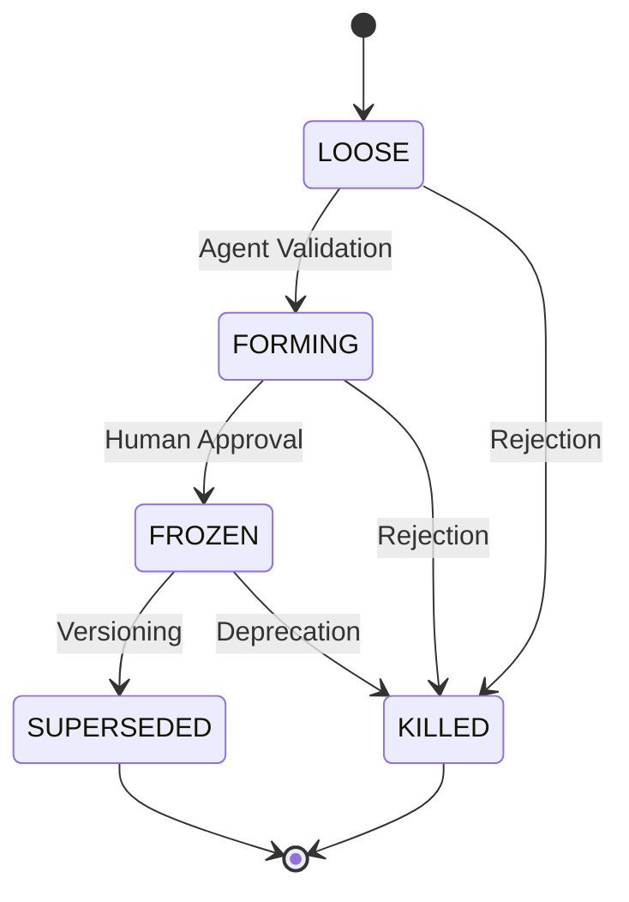

# MODULE_DEEP_DIVES

## 1. Ingestion Engine (`src/nexus/sync`)

### Architectural Goal
To transform linear, unstructured streams (chat logs, code) into atomic, content-addressed units ("Bricks") with cryptographic provenance, ensuring zero data loss and historical integrity.

### Critical Path: `register_run_safe`
This method in `SyncDatabase` implements **Zero-Trust Append Validation**. It ensures that once a source run is registered, its history cannot be rewritten, only extended.

**Logic Flow:**
1.  **Fetch Existing:** Retrieve the current state of the run from the DB.
2.  **Monotonicity Check:** Ensure the new length >= old length.
3.  **Prefix Match:** Verify that the `message_id`s of the overlapping segment match exactly.
    *   **Violation:** If mismatch, raise `AppendViolationError`.
    *   **Success:** Append new messages and update `last_processed_index`.

### Data Flow

## 2. Knowledge Graph Manager (`src/nexus/graph`)

### Architectural Goal
To manage the lifecycle of Knowledge Nodes (Intents), enforcing valid state transitions and maintaining a versioned history of "Truth".

### Lifecycle State Machine
The `GraphManager` enforces the following transitions:

*   **LOOSE -> FORMING:**  Automated promotion via `mark_forming` (e.g., when an agent resolves a Brick to a User Intent).
*   **FORMING -> FROZEN:** Explicit human/agent approval via `promote_node_to_frozen`. Locks the node.
*   **FROZEN -> SUPERSEDED:** A new FROZEN node replaces an old one (`supersede_node`). The old node points to the new one.
*   **ANY -> KILLED:** Explicit rejection (`kill_node`).

### Conflict Resolution Strategy
*   **Monotonicity:** Newer information overrides older *unless* the older information is FROZEN.
*   **Anchors:** FROZEN nodes act as anchors. New information that conflicts with a FROZEN node is either rejected or must explicitly Supersede it.

## 3. Cognitive Assembler (`src/nexus/cognition`)

### Architectural Goal
To synthesize high-level "Topic Artifacts" from low-level Bricks using LLMs (DSPy), and write the discovered facts back into the Graph.

### Assembly Pipeline (`assemble_topic`)

1.  **Recall:** Fetch relevant Bricks using `nexus.ask.recall`.
2.  **Expansion:** Load full source trees for context.
3.  **Extraction (DSPy):**
    *   **Input:** Aggregated context + Topology (existing FROZEN intents).
    *   **Process:** LLM extracts "Facts" and "Relationships".
    *   **Output:** Structured JSON.
4.  **Persistence:** Save JSON Artifact to disk (content-addressed).
5.  **Graph Linkage:**
    *   Create `Artifact` node.
    *   Link `Topic` -> `Artifact`.
    *   **Conflict Resolution:**
        *   If new fact ~= Existing FROZEN Intent: **Respect Anchor** (create link, do not overwrite).
        *   If new fact ~= Existing FORMING Intent: **Supersede** (if similarity > threshold).
        *   Else: Create new FORMING Intent.

### Risk Profile
*   **High Latency:** Dependent on LLM response time.
*   **Hallucination:** DSPy constraints mitigate this, but valid verification is required.
*   **Cost:** Token usage is tracked via `AuditLog`.
