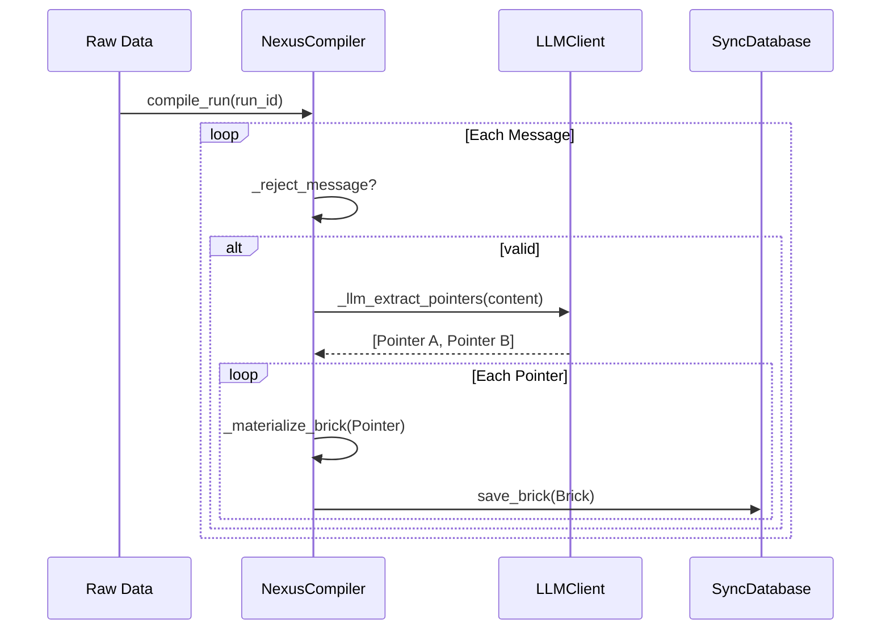
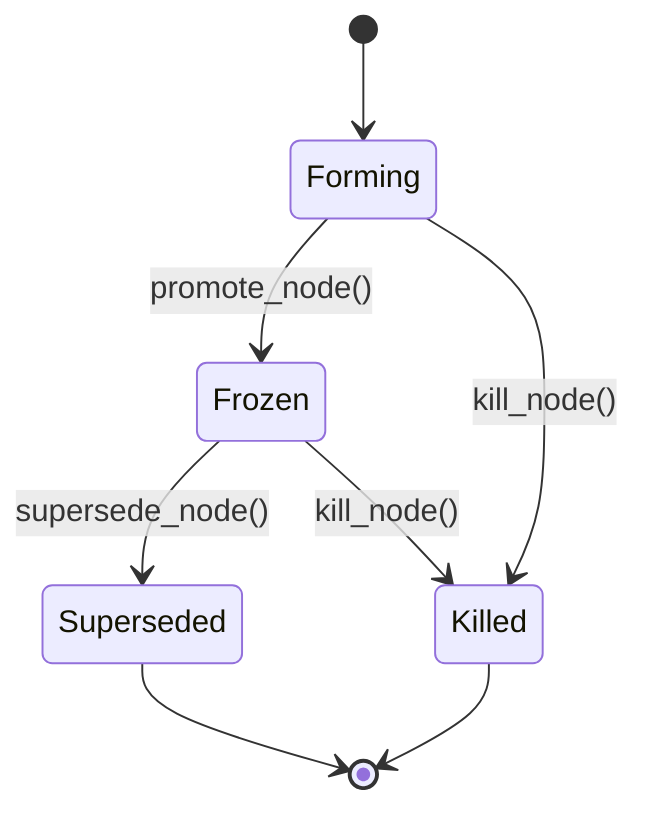
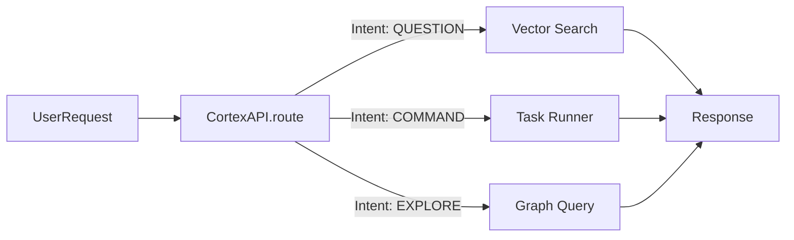

# MODULE_DEEP_DIVES

## 1. Ingestion & Compilation (`src/nexus/sync`)

### Deep Dive: `NexusCompiler`
The Compiler is the heart of the ingestion process. It transforms raw unstructured text into structured "Bricks".

#### Control Flow
1. **Input:** Receives a batch of messages or a JSON object.
2. **Filtering:** Calls `_reject_message` to discard noise (short messages, system logs).
3. **Signal Detection:** Checks for meaningful content using `_has_signal`.
4. **Pointer Extraction:** Uses LLM (`_llm_extract_pointers`) to identify potential concepts.
5. **Materialization:** Converts pointers into Bricks via `_materialize_brick`, persisting them to `SyncDatabase`.

## 2. Graph Lifecycle Management (`src/nexus/graph`)

### Deep Dive: `GraphManager`
Manages the lifecycle of nodes within the Knowledge Graph. It ensures referential integrity and enforces invariants.

#### Node Lifecycle
1. **Forming:** A node starts as a loose collection of Bricks.
2. **Frozen:** Once sufficient confidence is reached, it is promoted to `Frozen`.
3. **Superseded:** If a better node replaces it, it transitions to `Superseded`.
4. **Killed:** If invalid, it is `Killed`.

#### Visual Logic: Cycle Detection
Before adding an edge, `_check_for_cycle` runs a DFS to ensure no circular dependencies are introduced.

## 3. Cognition & Synthesis (`src/nexus/cognition`)

### Deep Dive: `RelationshipSynthesizer`
This module runs asynchronously to discover hidden connections between graph nodes.

#### Process
1. **Scan:** Iterates over topics/intents in the graph.
2. **DSPy Execution:** Uses `RelationshipSignature` to ask the LLM "How are A and B related?".
3. **Edge Creation:** If a relationship is found, calls `GraphManager.register_edge`.

### Deep Dive: `CoverageSentinel`
Monitors the "completeness" of a topic.
1. **Score:** Calculates a coverage score (0.0 - 1.0) based on brick density and conflicts.
2. **Alert:** If score < Threshold, raises an Alert via `AlertManager`.
3. **Heal:** `PromptGenerator` creates specific prompts to fill the gap.

## 4. Service Orchestration (`services/cortex`)

### Deep Dive: `CortexAPI`
Acts as the brain, routing user requests to the appropriate subsystem.

#### Request Routing
- **`ask_preview`**: Fast path, RAG-only.
- **`generate`**: Full agentic path, might trigger graph updates.
- **`synthesize`**: Triggers background cognition tasks.

