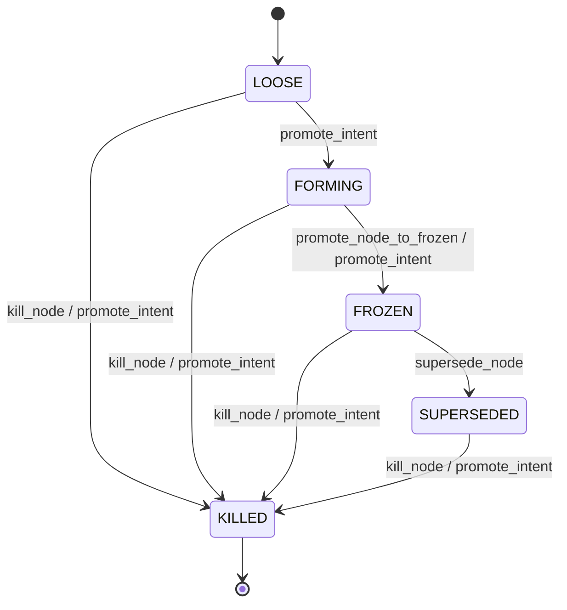

# RULES_AND_INVARIANTS.md

## 1. Data & State Modeling

### 1.1. Core Entities (Nodes in Knowledge Graph)

*   **Intent**: Represents a core requirement, decision, or piece of knowledge. Has a `lifecycle` (LOOSE, FORMING, FROZEN, SUPERSEDED, KILLED) and `intent_type`.
    *   **State Transition**: LOOSE -> FORMING -> FROZEN -> SUPERSEDED / KILLED.
    *   **Transitions**: Managed by `GraphManager.promote_intent`.
*   **Source**: Raw input content from which intents or other nodes are extracted (e.g., code snippets, markdown sections).
*   **ScopeNode**: Defines the applicability or context of an Intent (e.g., "Frontend UI", "Database Layer").
*   **Brick**: A granular piece of information, potentially a precursor to an Intent or a structural element identified during ingestion.

### 1.2. Relationships (Edges in Knowledge Graph)

*   **DEPENDS_ON**: One intent/node relies on another.
*   **CONFLICTS_WITH**: Two intents/nodes are mutually exclusive or contradictory.
*   **OVERRIDES**: A newer or more specific intent/node replaces an older/general one. Crucially, the source must be `FROZEN`, and a target can only have one `OVERRIDES` edge. This ensures a clear lineage and prevents ambiguity.
*   **SUPERSEDED_BY**: Indicates an older node has been replaced by a newer one. Both must be `FROZEN` at the time of superseding.
*   **ASSEMBLED_IN**: Links a node (e.g., Brick, Intent) to a `Topic` (e.g., `nexus-server-sync`).
*   **APPLIES_TO**: Links an `Intent` to a `ScopeNode`, defining its architectural applicability.

## 2. State Transition Logic (Example: `IntentLifecycle`)

*   **LOOSE**: Initial state, raw or unverified. Can be promoted to `FORMING` or `KILLED`.
*   **FORMING**: Under active review or refinement. Can be promoted to `FROZEN` or `KILLED`.
*   **FROZEN**: Stable, verified, and active. Can be `SUPERSEDED` or `KILLED`. Requires an `APPLIES_TO` edge.
*   **SUPERSEDED**: Replaced by a newer `FROZEN` intent. Can be `KILLED`.  
*   **KILLED**: Explicitly rejected or deprecated. Terminal state.

## 3. Entry Point Mapping

### 3.1. CLI Entry Points

*   **`src/nexus/cli/main.py`**:
    *   **`main()`**: The primary entry point for CLI operations, likely parsing arguments to dispatch commands.

### 3.2. API Entry Points

*   **`services/cortex/api.py`**:
    *   Contains FastAPI routes for exposing core Nexus functionalities.
    *   **Examples**: `/intents`, `/graphs`, `/query` (inferred).
*   **`services/cortex/server.py`**:
    *   Sets up the FastAPI application and serves the API.

### 3.3. Event Entry Points

*   **`services/cortex/tasks.py`**:
    *   Defines Celery tasks that can be triggered by events (e.g., new code commit, scheduled sync, user action).
    *   **Examples**: `process_ingestion_task`, `synthesize_relationships_task` (inferred).
*   **`src/nexus/sync/__main__.py`**:
    *   Likely an entry point for kick-starting the synchronization pipeline, possibly triggered by a cron job or a file system event listener.

## 4. Agent Safety Rails / Invariant Enforcers

This section explicitly lists critical invariants and \\\\'Do Not Touch\\\\' zones for agentic operations.

*   **Cycle Prevention (GraphManager)**: The `GraphManager._check_for_cycle` method explicitly prevents cycles when adding `OVERRIDES` or `SUPERSEDED_BY` edges. Any agent attempting to create a cyclical dependency of these types **MUST** be rejected.
    *   **Location**: `src/nexus/graph/manager.py`
    *   **Mandatory Verification Hook**: Agents proposing graph modifications MUST call `GraphManager.register_edge` and handle `ValueError` for cycle detection.

*   **LLM Routing Monotonicity (LLMRouter)**: The `LLMRouter` (`src/nexus/sync/llm.py`) implements a canonical, frozen routing table for LLM calls based on `intent_class` and `cost_tolerance`. Agents **MUST NOT** bypass this router or attempt to dynamically modify its logic.
    *   **Location**: `src/nexus/sync/llm.py` (`LLMRouter.route` method)
    *   **Mandatory Verification Hook**: All LLM calls involving external models **MUST** go through `LLMClient.generate` which, in turn, uses `LLMRouter.route`.

*   **Intent Lifecycle Monotonicity (GraphManager)**: Intents can only transition through predefined lifecycle states (`LOOSE` -> `FORMING` -> `FROZEN` -> `SUPERSEDED` / `KILLED`). Agents **MUST NOT** attempt to force invalid state transitions.
    *   **Location**: `src/nexus/graph/manager.py` (`GraphManager.promote_intent` method)
    *   **Mandatory Verification Hook**: Any agent modifying an `Intent` lifecycle **MUST** use `GraphManager.promote_intent` and respect the `ValueError` for invalid transitions.

*   **`FROZEN` Intent Invariants (GraphManager)**: An `Intent` cannot be `FROZEN` without an `APPLIES_TO` edge connecting it to a `ScopeNode`. This ensures all \\\\'active\\\\' intents have a defined architectural applicability.
    *   **Location**: `src/nexus/graph/manager.py` (`GraphManager.promote_intent` method)
    *   **Mandatory Verification Hook**: Agents proposing to `FREEZE` an `Intent` **MUST** ensure an `APPLIES_TO` edge exists or create one beforehand.

*   **Single `OVERRIDES` Target Invariant (GraphManager)**: A target node can only be `OVERRIDDEN` by a single source node. This prevents ambiguous overrides.
    *   **Location**: `src/nexus/graph/manager.py` (`GraphManager.add_typed_edge` method, for `EdgeType.OVERRIDES`)
    *   **Mandatory Verification Hook**: Agents attempting to create `OVERRIDES` edges **MUST** handle `ValueError` if the target is already overridden.

*   **Strict Structured Ingestion (StructuredIngestLLM)**: For critical ingestion tasks (`INGEST_EXTRACT` intent), agents **MUST** use `StructuredIngestLLM` to ensure deterministic, grammar-constrained output. Direct use of `LLMClient.generate` for this intent is forbidden.
    *   **Location**: `src/nexus/sync/llm.py` (`LLMClient.generate` and `StructuredIngestLLM`)
    *   **Mandatory Verification Hook**: Agents performing ingestion of structured data **MUST** utilize `StructuredIngestLLM.extract`.

*   **Economic Cognition Invariant (GraphManager)**: Any operation that invokes a non-free LLM model (`ModelTier.L2`, `L3`) **MUST** emit explicit cost metadata in the audit log.
    *   **Location**: `src/nexus/graph/manager.py` (`GraphManager._log_audit_event`)
    *   **Mandatory Verification Hook**: When logging audit events for paid LLM calls, agents **MUST** populate `cost_usd`, `tokens_in`, and `tokens_out` parameters.

---

